<h1>Table of Contents<span class="tocSkip"></span></h1>
<div class="toc"><ul class="toc-item"><li><span><a href="#Предобработка-данных" data-toc-modified-id="Предобработка-данных-1"><span class="toc-item-num">1&nbsp;&nbsp;</span>Предобработка данных</a></span></li><li><span><a href="#Исследовательский-анализ-данных" data-toc-modified-id="Исследовательский-анализ-данных-2"><span class="toc-item-num">2&nbsp;&nbsp;</span>Исследовательский анализ данных</a></span><ul class="toc-item"><li><span><a href="#Общее-количество-покупок" data-toc-modified-id="Общее-количество-покупок-2.1"><span class="toc-item-num">2.1&nbsp;&nbsp;</span>Общее количество покупок</a></span></li><li><span><a href="#Общее-количество-уникальных-пользователей" data-toc-modified-id="Общее-количество-уникальных-пользователей-2.2"><span class="toc-item-num">2.2&nbsp;&nbsp;</span>Общее количество уникальных пользователей</a></span></li><li><span><a href="#Определение-оптимального-периода-для-анализа" data-toc-modified-id="Определение-оптимального-периода-для-анализа-2.3"><span class="toc-item-num">2.3&nbsp;&nbsp;</span>Определение оптимального периода для анализа</a></span></li><li><span><a href="#Общая-выручка-магазина" data-toc-modified-id="Общая-выручка-магазина-2.4"><span class="toc-item-num">2.4&nbsp;&nbsp;</span>Общая выручка магазина</a></span></li><li><span><a href="#Средний-чек-покупателя" data-toc-modified-id="Средний-чек-покупателя-2.5"><span class="toc-item-num">2.5&nbsp;&nbsp;</span>Средний чек покупателя</a></span></li><li><span><a href="#Среднее-количество-продуктов-в-заказе" data-toc-modified-id="Среднее-количество-продуктов-в-заказе-2.6"><span class="toc-item-num">2.6&nbsp;&nbsp;</span>Среднее количество продуктов в заказе</a></span></li><li><span><a href="#Самые-популярные-товары-интернет-магазина" data-toc-modified-id="Самые-популярные-товары-интернет-магазина-2.7"><span class="toc-item-num">2.7&nbsp;&nbsp;</span>Самые популярные товары интернет-магазина</a></span></li><li><span><a href="#Самые-прибыльные-товары-для-компании" data-toc-modified-id="Самые-прибыльные-товары-для-компании-2.8"><span class="toc-item-num">2.8&nbsp;&nbsp;</span>Самые прибыльные товары для компании</a></span></li><li><span><a href="#Средняя-частота-покупок" data-toc-modified-id="Средняя-частота-покупок-2.9"><span class="toc-item-num">2.9&nbsp;&nbsp;</span>Средняя частота покупок</a></span></li><li><span><a href="#Общий-вывод-по-разделу" data-toc-modified-id="Общий-вывод-по-разделу-2.10"><span class="toc-item-num">2.10&nbsp;&nbsp;</span>Общий вывод по разделу</a></span></li></ul></li><li><span><a href="#Сегментация-пользователей" data-toc-modified-id="Сегментация-пользователей-3"><span class="toc-item-num">3&nbsp;&nbsp;</span>Сегментация пользователей</a></span><ul class="toc-item"><li><span><a href="#RFM-анализ" data-toc-modified-id="RFM-анализ-3.1"><span class="toc-item-num">3.1&nbsp;&nbsp;</span>RFM-анализ</a></span></li><li><span><a href="#Определение-товарных-категорий" data-toc-modified-id="Определение-товарных-категорий-3.2"><span class="toc-item-num">3.2&nbsp;&nbsp;</span>Определение товарных категорий</a></span></li><li><span><a href="#Общий-вывод" data-toc-modified-id="Общий-вывод-3.3"><span class="toc-item-num">3.3&nbsp;&nbsp;</span>Общий вывод</a></span></li></ul></li><li><span><a href="#Проверка-статистических-гипотез" data-toc-modified-id="Проверка-статистических-гипотез-4"><span class="toc-item-num">4&nbsp;&nbsp;</span>Проверка статистических гипотез</a></span><ul class="toc-item"><li><span><a href="#Группировка-данных-для-проведения-анализа" data-toc-modified-id="Группировка-данных-для-проведения-анализа-4.1"><span class="toc-item-num">4.1&nbsp;&nbsp;</span>Группировка данных для проведения анализа</a></span></li><li><span><a href="#Формулировка-нулевой-и-альтернативной-гипотез" data-toc-modified-id="Формулировка-нулевой-и-альтернативной-гипотез-4.2"><span class="toc-item-num">4.2&nbsp;&nbsp;</span>Формулировка нулевой и альтернативной гипотез</a></span></li><li><span><a href="#Проведение-теста-и-интерпретация-результатов." data-toc-modified-id="Проведение-теста-и-интерпретация-результатов.-4.3"><span class="toc-item-num">4.3&nbsp;&nbsp;</span>Проведение теста и интерпретация результатов.</a></span></li></ul></li><li><span><a href="#Результат-исследования" data-toc-modified-id="Результат-исследования-5"><span class="toc-item-num">5&nbsp;&nbsp;</span>Результат исследования</a></span></li></ul></div>

# Выпускной проект "E-commerce — Выявление профилей потребления"

[Презентация](https://drive.google.com/file/d/1iCcBzdHe-fASnn9OkwAq0_klDPe65z7X/view?usp=drive_link)

[Дашборд](https://public.tableau.com/app/profile/kseniia.gaivoronskaia/viz/-_16910581904880/sheet0_1?publish=yes)

**Заказчик:** Интернет-магазин товаров для дома «Пока все ещё тут»

**Цель исследования:** 
- Сегментировать покупателей по профилю потребления и сформулировать рекомендации для бизнеса для дальнейшей работы с сегментами. 

**План работы:**
1. Подготовить предоставленные данные к корректному анализу, провести предобработку данных - проверить на пропуски, явные/неявные дубликаты, корректный тип данных и т.д.
2. Провести исследовательский анализ данных:
    - определить общее количество покупок в датасете;
    - найти общее количество уникальных пользователей в выгрузке;
    - найти максимальную и минимальную даты, зарегистрированные в датасете;
    - определить оптимальный период для дальнейшего анализа;
    - определить общую выручку магазина, средний чек с покупателя;
    - найти среднее количество продуктов в заказе;
    - посмотреть динамику продаж;
    - найти самые прибыльные товары для магазина (провести ABC-анализ);
    - определить среднюю частоту покупок (как часто пользователи возвращаются за повторной покупкой);
    - сделать выводы о текущей ситуации в онлайн-магазине, основываясь на выявленных показателях;
3. Провести сегментацию пользователей на основе истории их покупок:
    - определить профиль пользователей: как "выглядит" наш типичный пользователь (что покупает, как часто, возвращается за повторной покупкой)
    - провести RFM-анализ (разделить покупателей на группы, основываясь на количестве покупок, среднем чеке, дате последней покупки). 
    - определить, какая доля людей делает крупные покупки, какая - мелкие.
    - выделить основные товарные категории
    - на основе товарных категорий и заказов, определить сегментацию пользователей.
    - выявить какую выручку приносит компании каждый сегмент потребителей
4. Проверить статистические гипотезы (в ходе исследования формулировки могут меняться и дополняться):
    - Средняя выручка между сегментами пользователей отличается и это отличие является статистически значимым.
    - Средний чек между сегментами пользователей отличается и это отличие является статистически значимым.
5. На базе проведенного исследования подготовить рекомендации для бизнеса по работе с каждым из выявленных сегментов пользователей. 

**Описание данных**:
- `date` — дата заказа;
- `customer_id` — идентификатор покупателя;
- `order_id` — идентификатор заказа;
- `product` — наименование товара;
- `quantity` — количество товара в заказе;
- `price` — цена товара.

## Предобработка данных


```python
# импортируем библиотеки
import pandas as pd
import matplotlib.pyplot as plt
from datetime import timedelta
import scipy.stats as stats

# импорты plotly
import plotly.graph_objs as go
import plotly.express as px
from plotly.subplots import make_subplots
import plotly.io as pio
from IPython.display import Image, display
```


```python
# загружаем данные
df = pd.read_csv('C:/anaconda/Datasets/ecom_dataset_upd.csv')
```


```python
def check_dataset(dataset):
# выводим общую информацию о датасете
    print("Информация о датасете:")
    print("--------------------")
    dataset.info()
    print("\n")

    print("Описание данных:")
    print("--------------------")
    print(dataset.describe())
    print("\n")
    
# проверяем наличие дубликатов в таблицах
    print("Поиск явных дубликатов:")
    print("--------------")
    duplicates = dataset.duplicated()
    if duplicates.any():
        print(dataset[duplicates])
    else:
        print("Дубликаты не найдены")
    print("\n")
    
# проверяем данные на наличие пропусков
    print("Наличие пропусков в датасете (NaN):")
    print("---------------------")
    missing_values = dataset.isna().sum()
    if missing_values.any():
        print(missing_values)
    else:
        print("Пропуски отсутствуют (NaN)")
    print("\n")
```


```python
check_dataset(df)
```

    Информация о датасете:
    --------------------
    <class 'pandas.core.frame.DataFrame'>
    RangeIndex: 7474 entries, 0 to 7473
    Data columns (total 6 columns):
     #   Column       Non-Null Count  Dtype  
    ---  ------       --------------  -----  
     0   date         7474 non-null   int64  
     1   customer_id  7474 non-null   object 
     2   order_id     7474 non-null   int64  
     3   product      7474 non-null   object 
     4   quantity     7474 non-null   int64  
     5   price        7474 non-null   float64
    dtypes: float64(1), int64(3), object(2)
    memory usage: 350.5+ KB
    
    
    Описание данных:
    --------------------
                   date       order_id     quantity         price
    count  7.474000e+03    7474.000000  7474.000000   7474.000000
    mean   2.018913e+09   49449.884265     2.362858    478.737501
    std    4.278878e+05   32679.642404    14.500497    901.615895
    min    2.018100e+09   12624.000000     1.000000      9.000000
    25%    2.019022e+09   14833.000000     1.000000     97.000000
    50%    2.019051e+09   68768.000000     1.000000    135.000000
    75%    2.019063e+09   71257.750000     1.000000    439.000000
    max    2.020013e+09  112789.000000  1000.000000  14917.000000
    
    
    Поиск явных дубликатов:
    --------------
    Дубликаты не найдены
    
    
    Наличие пропусков в датасете (NaN):
    ---------------------
    Пропуски отсутствуют (NaN)
    
    
    

1. При первичном анализе датасета дубликатов не обнаружено, пропусков в данных нет. 
2. Всего в датасете представлено 7474 строки, 6 колонок. 
3. в разделе описания данных можно заметить, что в колонках `quantity` и `price` возможно встречаются аномальные значения, требующие внимания. Максимальное значение кол-ва товаров - 1000 шт. при медианном в 1 шт. Максимальное значение цены товара - 14,9 тыс. рублей при медианном значении - 439 рублей. Далее дополнительно построим гистограмму распределения данных. 
4. Требуется изменить тип данных в колонке `date`.


```python
# заменим формат данных в колонке `date`
df['date'] = pd.to_datetime(df['date'], format='%Y%m%d%H')

# создадим отдельный столбец только с датой (без времени)
df['dt'] = pd.to_datetime(df['date']).dt.date

# создадим отдельный столбец только с месяцем заказа
df['month'] = pd.to_datetime(df['date']).dt.strftime('%Y-%m')
```


```python
# приводим данные к нижнему регистру
df['product'] = df['product'].str.lower()
```


```python
# посмотрим общее распределение количественных данных в колонках
df.hist(figsize=(15, 15))
plt.suptitle('Общее распределение данных в колонках')
plt.show()
```


    
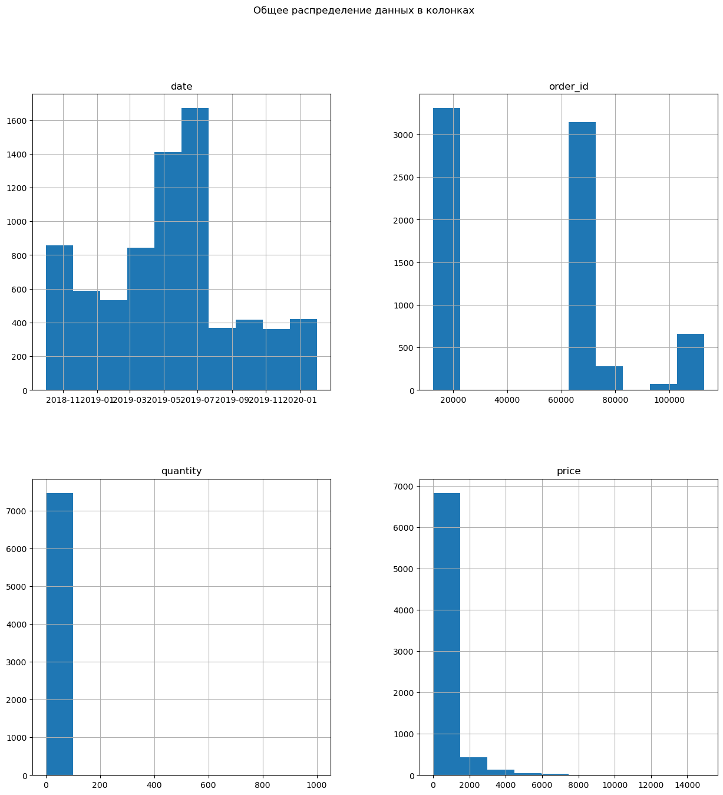
    


1. Как мы отмечали выше, данные в столбцах `quantity` и `price` распределены неравномерно. 
2. Основная масса значений в колонке `quantity` находится в пределах до 2 шт. Аномальные значения достигают отметки в 1000 шт. 
3. Распределение в колонке `price` чуть более равномерное, но все ещё имеет длинный хвост справа, достигая максимальных значений до 15 тыс. рублей. 

В рамках исследовательского анализа данных мы дополнительно проверим, какую долю аномальных значений требуется отрубить. 

Дополнительно проверим датасет на наличие неявных дубликатов. Если они и есть, они должны иметь одинаковый id заказа, id клиента и название товара. В остальных случаях это скорее всего другой заказ. 


```python
# проверим датасет на наличие неявных дубликатов
pd.set_option('display.max_colwidth', None) 

df_duplicated = df[df.duplicated(['product', 'customer_id', 'order_id', 'quantity', 'price'])]
display(df_duplicated.sort_values (by = ['customer_id', 'order_id', 'product']).head(30))
len(df_duplicated)
```


<div>
<style scoped>
    .dataframe tbody tr th:only-of-type {
        vertical-align: middle;
    }

    .dataframe tbody tr th {
        vertical-align: top;
    }

    .dataframe thead th {
        text-align: right;
    }
</style>
<table border="1" class="dataframe">
  <thead>
    <tr style="text-align: right;">
      <th></th>
      <th>date</th>
      <th>customer_id</th>
      <th>order_id</th>
      <th>product</th>
      <th>quantity</th>
      <th>price</th>
      <th>dt</th>
      <th>month</th>
    </tr>
  </thead>
  <tbody>
    <tr>
      <th>2241</th>
      <td>2019-03-07 11:00:00</td>
      <td>0184f535-b60a-4914-a982-231e3f615206</td>
      <td>14566</td>
      <td>пеларгония розебудная margaretha укорененный черенок</td>
      <td>1</td>
      <td>135.0</td>
      <td>2019-03-07</td>
      <td>2019-03</td>
    </tr>
    <tr>
      <th>2242</th>
      <td>2019-03-07 11:00:00</td>
      <td>0184f535-b60a-4914-a982-231e3f615206</td>
      <td>14566</td>
      <td>пеларгония розебудная mary укорененный черенок</td>
      <td>1</td>
      <td>135.0</td>
      <td>2019-03-07</td>
      <td>2019-03</td>
    </tr>
    <tr>
      <th>2243</th>
      <td>2019-03-07 11:00:00</td>
      <td>0184f535-b60a-4914-a982-231e3f615206</td>
      <td>14566</td>
      <td>пеларгония розебудная prins nikolai укорененный черенок</td>
      <td>1</td>
      <td>135.0</td>
      <td>2019-03-07</td>
      <td>2019-03</td>
    </tr>
    <tr>
      <th>2244</th>
      <td>2019-03-07 11:00:00</td>
      <td>0184f535-b60a-4914-a982-231e3f615206</td>
      <td>14566</td>
      <td>пеларгония розебудная red pandora укорененный черенок</td>
      <td>1</td>
      <td>135.0</td>
      <td>2019-03-07</td>
      <td>2019-03</td>
    </tr>
    <tr>
      <th>2891</th>
      <td>2019-04-16 16:00:00</td>
      <td>0184f535-b60a-4914-a982-231e3f615206</td>
      <td>14649</td>
      <td>бакопа ампельная махровая сиреневая махровая объем 0,5 л</td>
      <td>1</td>
      <td>90.0</td>
      <td>2019-04-16</td>
      <td>2019-04</td>
    </tr>
    <tr>
      <th>2892</th>
      <td>2019-04-16 16:00:00</td>
      <td>0184f535-b60a-4914-a982-231e3f615206</td>
      <td>14649</td>
      <td>бакопа ампельная махровая фиолетовая махровая объем 0,5 л</td>
      <td>1</td>
      <td>90.0</td>
      <td>2019-04-16</td>
      <td>2019-04</td>
    </tr>
    <tr>
      <th>2893</th>
      <td>2019-04-16 16:00:00</td>
      <td>0184f535-b60a-4914-a982-231e3f615206</td>
      <td>14649</td>
      <td>газания рассада однолетних цветов в кассете по 6 шт</td>
      <td>1</td>
      <td>210.0</td>
      <td>2019-04-16</td>
      <td>2019-04</td>
    </tr>
    <tr>
      <th>2894</th>
      <td>2019-04-16 16:00:00</td>
      <td>0184f535-b60a-4914-a982-231e3f615206</td>
      <td>14649</td>
      <td>калибрахоа aloha double purple сиреневая махровая объем 0,5 л</td>
      <td>1</td>
      <td>90.0</td>
      <td>2019-04-16</td>
      <td>2019-04</td>
    </tr>
    <tr>
      <th>2895</th>
      <td>2019-04-16 16:00:00</td>
      <td>0184f535-b60a-4914-a982-231e3f615206</td>
      <td>14649</td>
      <td>калибрахоа aloha tiki neon малиновая объем 0,5 л</td>
      <td>1</td>
      <td>90.0</td>
      <td>2019-04-16</td>
      <td>2019-04</td>
    </tr>
    <tr>
      <th>2896</th>
      <td>2019-04-16 16:00:00</td>
      <td>0184f535-b60a-4914-a982-231e3f615206</td>
      <td>14649</td>
      <td>калибрахоа bloomtastic blossom розово-сиреневая объем 0,5 л</td>
      <td>1</td>
      <td>90.0</td>
      <td>2019-04-16</td>
      <td>2019-04</td>
    </tr>
    <tr>
      <th>2897</th>
      <td>2019-04-16 16:00:00</td>
      <td>0184f535-b60a-4914-a982-231e3f615206</td>
      <td>14649</td>
      <td>калибрахоа mini famous double red красная махровая объем 0,5 л</td>
      <td>1</td>
      <td>90.0</td>
      <td>2019-04-16</td>
      <td>2019-04</td>
    </tr>
    <tr>
      <th>2898</th>
      <td>2019-04-16 16:00:00</td>
      <td>0184f535-b60a-4914-a982-231e3f615206</td>
      <td>14649</td>
      <td>калибрахоа rave violet сиреневая звезда объем 0,5 л</td>
      <td>1</td>
      <td>90.0</td>
      <td>2019-04-16</td>
      <td>2019-04</td>
    </tr>
    <tr>
      <th>2899</th>
      <td>2019-04-16 16:00:00</td>
      <td>0184f535-b60a-4914-a982-231e3f615206</td>
      <td>14649</td>
      <td>калибрахоа sweet bells double golden желтая махровая объем 0,5 л</td>
      <td>1</td>
      <td>90.0</td>
      <td>2019-04-16</td>
      <td>2019-04</td>
    </tr>
    <tr>
      <th>2900</th>
      <td>2019-04-16 16:00:00</td>
      <td>0184f535-b60a-4914-a982-231e3f615206</td>
      <td>14649</td>
      <td>львиный зев рассада однолетних цветов в кассете по 6 шт</td>
      <td>1</td>
      <td>128.0</td>
      <td>2019-04-16</td>
      <td>2019-04</td>
    </tr>
    <tr>
      <th>2902</th>
      <td>2019-04-16 16:00:00</td>
      <td>0184f535-b60a-4914-a982-231e3f615206</td>
      <td>14649</td>
      <td>петуния surprice yellow желтая с прожилками объем 0,5 л</td>
      <td>1</td>
      <td>90.0</td>
      <td>2019-04-16</td>
      <td>2019-04</td>
    </tr>
    <tr>
      <th>2903</th>
      <td>2019-04-16 16:00:00</td>
      <td>0184f535-b60a-4914-a982-231e3f615206</td>
      <td>14649</td>
      <td>петуния sweetunia black satin черная объем 0,5 л</td>
      <td>1</td>
      <td>90.0</td>
      <td>2019-04-16</td>
      <td>2019-04</td>
    </tr>
    <tr>
      <th>2904</th>
      <td>2019-04-16 16:00:00</td>
      <td>0184f535-b60a-4914-a982-231e3f615206</td>
      <td>14649</td>
      <td>томата (помидор) баскью блю №7 сорт детерминантный среднеспелый синий</td>
      <td>1</td>
      <td>38.0</td>
      <td>2019-04-16</td>
      <td>2019-04</td>
    </tr>
    <tr>
      <th>6086</th>
      <td>2019-08-13 09:00:00</td>
      <td>019ddfb4-f9fe-4b17-88bb-0ec9edb56479</td>
      <td>72274</td>
      <td>сумка-тележка twin стальной каркас 56 л серая, gimi</td>
      <td>1</td>
      <td>2549.0</td>
      <td>2019-08-13</td>
      <td>2019-08</td>
    </tr>
    <tr>
      <th>1276</th>
      <td>2018-12-20 12:00:00</td>
      <td>028469c0-9e87-4596-ac2e-c5b1d48ea9b6</td>
      <td>69421</td>
      <td>крючок одежный двойной усиленный алюминиевый (дюраль), 1110015</td>
      <td>30</td>
      <td>26.0</td>
      <td>2018-12-20</td>
      <td>2018-12</td>
    </tr>
    <tr>
      <th>1433</th>
      <td>2019-01-03 21:00:00</td>
      <td>028469c0-9e87-4596-ac2e-c5b1d48ea9b6</td>
      <td>69421</td>
      <td>крючок одежный двойной усиленный алюминиевый (дюраль), 1110015</td>
      <td>30</td>
      <td>26.0</td>
      <td>2019-01-03</td>
      <td>2019-01</td>
    </tr>
    <tr>
      <th>2038</th>
      <td>2019-02-26 12:00:00</td>
      <td>036edc2c-d0ad-4c71-99f6-226db1b883f4</td>
      <td>70463</td>
      <td>салатник luminarc поэма анис 12 см j1349</td>
      <td>2</td>
      <td>239.0</td>
      <td>2019-02-26</td>
      <td>2019-02</td>
    </tr>
    <tr>
      <th>5489</th>
      <td>2019-06-19 21:00:00</td>
      <td>03865a43-8c19-4d4e-ab51-7ec516614a83</td>
      <td>14870</td>
      <td>пеларгония розебудная prins nikolai укорененный черенок</td>
      <td>1</td>
      <td>135.0</td>
      <td>2019-06-19</td>
      <td>2019-06</td>
    </tr>
    <tr>
      <th>5490</th>
      <td>2019-06-19 21:00:00</td>
      <td>03865a43-8c19-4d4e-ab51-7ec516614a83</td>
      <td>14870</td>
      <td>пеларгония розебудная queen ingrid укорененный черенок</td>
      <td>1</td>
      <td>135.0</td>
      <td>2019-06-19</td>
      <td>2019-06</td>
    </tr>
    <tr>
      <th>6472</th>
      <td>2019-09-29 19:00:00</td>
      <td>05f74c6f-2395-45ac-a826-9e070652de3e</td>
      <td>72786</td>
      <td>коврик придверный apache 45х76 см flagstone 5415</td>
      <td>1</td>
      <td>1199.0</td>
      <td>2019-09-29</td>
      <td>2019-09</td>
    </tr>
    <tr>
      <th>2021</th>
      <td>2019-02-25 15:00:00</td>
      <td>075873aa-644c-4a09-9253-204f3156ac7b</td>
      <td>70438</td>
      <td>ёрш унитазный с деревянной ручкой , ваир 1712012</td>
      <td>20</td>
      <td>56.0</td>
      <td>2019-02-25</td>
      <td>2019-02</td>
    </tr>
    <tr>
      <th>3964</th>
      <td>2019-05-21 05:00:00</td>
      <td>08d1c36d-1a94-4040-9cfe-f78a8e382a4a</td>
      <td>71479</td>
      <td>сумка-тележка 2-х колесная gimi argo синяя</td>
      <td>1</td>
      <td>1087.0</td>
      <td>2019-05-21</td>
      <td>2019-05</td>
    </tr>
    <tr>
      <th>5991</th>
      <td>2019-07-29 14:00:00</td>
      <td>09521bde-42aa-482f-a92d-cf82b082bc82</td>
      <td>72124</td>
      <td>муляж долька арбуза 14*7,5 см</td>
      <td>2</td>
      <td>59.0</td>
      <td>2019-07-29</td>
      <td>2019-07</td>
    </tr>
    <tr>
      <th>5993</th>
      <td>2019-07-29 21:00:00</td>
      <td>09521bde-42aa-482f-a92d-cf82b082bc82</td>
      <td>72124</td>
      <td>муляж долька арбуза 14*7,5 см</td>
      <td>2</td>
      <td>59.0</td>
      <td>2019-07-29</td>
      <td>2019-07</td>
    </tr>
    <tr>
      <th>1508</th>
      <td>2019-01-14 08:00:00</td>
      <td>0982f6b9-328f-4a67-b7ee-cd0a114868f0</td>
      <td>69807</td>
      <td>контейнер для свч полимербыт премиум 1,2 л 4356200</td>
      <td>1</td>
      <td>59.0</td>
      <td>2019-01-14</td>
      <td>2019-01</td>
    </tr>
    <tr>
      <th>4740</th>
      <td>2019-06-06 23:00:00</td>
      <td>09bcc3d0-8134-4f00-8ea5-b74b55d766ad</td>
      <td>71633</td>
      <td>стремянка scab balzo 762 5 ступеней алюминиевая 3885</td>
      <td>1</td>
      <td>5549.0</td>
      <td>2019-06-06</td>
      <td>2019-06</td>
    </tr>
  </tbody>
</table>
</div>


    1864


1. Всего мы нашли 1864 неявных дубликата. 
2. Если обратить внимание на таблицу, можно заметить, что каждой строке соответствует в среднем 6 дубликатов товара с разницей в дате события. Наше предположение, что в дубликаты возникли из-за обрезанной выгрузки логов - не хватает регистрации событий внутри интернет-магазина (открыл карточку товара -- добавил в корзину -- оплатил товар и т.д.).
3. Так как в рамках данного исследования нас интересует лишь факт покупки, мы удалим неявные дубликаты и оставим последнее событие - когда была осуществлена оплата товара. 


```python
# удаляем неявные дубликаты
df = df.sort_values('date').drop_duplicates(['product', 'customer_id', 'order_id', 'quantity', 'price'], keep='last')
```


```python
# добавим для удобства столбец со стоимостью товаров
df['total_cost'] = df['price'] * df['quantity']
```


```python
# проверим, что каждому заказу соответствует 1 дата и 1 пользователь
display(df.groupby('order_id').agg({'customer_id': 'nunique'}).query('customer_id > 1').count())
df.groupby('order_id').agg({'date': 'nunique'}).query('date > 1').count()
```


    customer_id    29
    dtype: int64


    date    54
    dtype: int64


1 заказу в 28 случаях соответствует более 2 пользователей и в 54 случаях - более 2-х дат. Необходимо посмотреть, что это за заказы и принять решение по фильтрации. 


```python
double_cust = (df.pivot_table(index = 'order_id',
                              values = 'customer_id',
                              aggfunc = 'nunique')
               .query('customer_id > 1')
               .reset_index())
double_cust = double_cust['order_id'].to_list()
df.query('order_id in @double_cust').sort_values(by = ['order_id', 'customer_id', 'product'])
```


<div>
<style scoped>
    .dataframe tbody tr th:only-of-type {
        vertical-align: middle;
    }

    .dataframe tbody tr th {
        vertical-align: top;
    }

    .dataframe thead th {
        text-align: right;
    }
</style>
<table border="1" class="dataframe">
  <thead>
    <tr style="text-align: right;">
      <th></th>
      <th>date</th>
      <th>customer_id</th>
      <th>order_id</th>
      <th>product</th>
      <th>quantity</th>
      <th>price</th>
      <th>dt</th>
      <th>month</th>
      <th>total_cost</th>
    </tr>
  </thead>
  <tbody>
    <tr>
      <th>5545</th>
      <td>2019-06-22 22:00:00</td>
      <td>4e861452-b692-48dc-b756-99a130b7a70a</td>
      <td>14872</td>
      <td>однолетнее растение петуния махровая в кассете 4 шт, россия</td>
      <td>2</td>
      <td>82.0</td>
      <td>2019-06-22</td>
      <td>2019-06</td>
      <td>164.0</td>
    </tr>
    <tr>
      <th>5546</th>
      <td>2019-06-22 22:00:00</td>
      <td>4e861452-b692-48dc-b756-99a130b7a70a</td>
      <td>14872</td>
      <td>однолетнее растение петуния простая в кассете по 4 шт, россия</td>
      <td>1</td>
      <td>82.0</td>
      <td>2019-06-22</td>
      <td>2019-06</td>
      <td>82.0</td>
    </tr>
    <tr>
      <th>5547</th>
      <td>2019-06-22 22:00:00</td>
      <td>4e861452-b692-48dc-b756-99a130b7a70a</td>
      <td>14872</td>
      <td>петуния махровая рассада однолетних цветов в кассете по 6 шт</td>
      <td>1</td>
      <td>128.0</td>
      <td>2019-06-22</td>
      <td>2019-06</td>
      <td>128.0</td>
    </tr>
    <tr>
      <th>5549</th>
      <td>2019-06-24 09:00:00</td>
      <td>9897ccd6-9441-4886-b709-b06361fabf6c</td>
      <td>14872</td>
      <td>однолетнее растение петуния махровая в кассете 4 шт, россия</td>
      <td>2</td>
      <td>82.0</td>
      <td>2019-06-24</td>
      <td>2019-06</td>
      <td>164.0</td>
    </tr>
    <tr>
      <th>5550</th>
      <td>2019-06-24 09:00:00</td>
      <td>9897ccd6-9441-4886-b709-b06361fabf6c</td>
      <td>14872</td>
      <td>однолетнее растение петуния простая в кассете по 4 шт, россия</td>
      <td>1</td>
      <td>82.0</td>
      <td>2019-06-24</td>
      <td>2019-06</td>
      <td>82.0</td>
    </tr>
    <tr>
      <th>...</th>
      <td>...</td>
      <td>...</td>
      <td>...</td>
      <td>...</td>
      <td>...</td>
      <td>...</td>
      <td>...</td>
      <td>...</td>
      <td>...</td>
    </tr>
    <tr>
      <th>6508</th>
      <td>2019-10-04 08:00:00</td>
      <td>25a8cd52-3efa-48ee-a6bd-d413d7e2b42f</td>
      <td>72845</td>
      <td>муляж яблоко зеленый 9 см полиуретан</td>
      <td>40</td>
      <td>59.0</td>
      <td>2019-10-04</td>
      <td>2019-10</td>
      <td>2360.0</td>
    </tr>
    <tr>
      <th>6538</th>
      <td>2019-10-07 20:00:00</td>
      <td>2ac05362-3ca7-4d19-899c-7ba266902611</td>
      <td>72845</td>
      <td>муляж яблоко зеленый 9 см полиуретан</td>
      <td>40</td>
      <td>59.0</td>
      <td>2019-10-07</td>
      <td>2019-10</td>
      <td>2360.0</td>
    </tr>
    <tr>
      <th>6504</th>
      <td>2019-10-03 14:00:00</td>
      <td>d8465f63-35db-4809-aff3-a8f7ebfc257f</td>
      <td>72845</td>
      <td>муляж яблоко зеленый 9 см полиуретан</td>
      <td>40</td>
      <td>59.0</td>
      <td>2019-10-03</td>
      <td>2019-10</td>
      <td>2360.0</td>
    </tr>
    <tr>
      <th>6606</th>
      <td>2019-10-14 09:00:00</td>
      <td>2f1671cc-47eb-49bb-a40b-808375f4218b</td>
      <td>72950</td>
      <td>кастрюля эмалированная стэма с-1624 12 л цилиндрическая без рисунка 1506037</td>
      <td>1</td>
      <td>974.0</td>
      <td>2019-10-14</td>
      <td>2019-10</td>
      <td>974.0</td>
    </tr>
    <tr>
      <th>6601</th>
      <td>2019-10-13 15:00:00</td>
      <td>b1dbc7c4-3c84-40a7-80c9-46e2f79d24ad</td>
      <td>72950</td>
      <td>кастрюля эмалированная стэма с-1624 12 л цилиндрическая без рисунка 1506037</td>
      <td>1</td>
      <td>974.0</td>
      <td>2019-10-13</td>
      <td>2019-10</td>
      <td>974.0</td>
    </tr>
  </tbody>
</table>
<p>66 rows × 9 columns</p>
</div>


```python
double_date = (df.pivot_table(index = 'order_id',
                              values = 'date',
                              aggfunc = 'nunique')
               .query('date > 1')
               .reset_index())
double_date = double_date['order_id'].to_list()
df.query('order_id in @double_date').sort_values(by = ['order_id', 'customer_id', 'product'])
```


<div>
<style scoped>
    .dataframe tbody tr th:only-of-type {
        vertical-align: middle;
    }

    .dataframe tbody tr th {
        vertical-align: top;
    }

    .dataframe thead th {
        text-align: right;
    }
</style>
<table border="1" class="dataframe">
  <thead>
    <tr style="text-align: right;">
      <th></th>
      <th>date</th>
      <th>customer_id</th>
      <th>order_id</th>
      <th>product</th>
      <th>quantity</th>
      <th>price</th>
      <th>dt</th>
      <th>month</th>
      <th>total_cost</th>
    </tr>
  </thead>
  <tbody>
    <tr>
      <th>554</th>
      <td>2018-10-31 13:00:00</td>
      <td>3ee43256-af7d-4036-90d4-eeefa1afc767</td>
      <td>14500</td>
      <td>многолетнее растение душица-орегано розовый объем 0,5 л</td>
      <td>1</td>
      <td>89.0</td>
      <td>2018-10-31</td>
      <td>2018-10</td>
      <td>89.0</td>
    </tr>
    <tr>
      <th>555</th>
      <td>2018-10-31 13:00:00</td>
      <td>3ee43256-af7d-4036-90d4-eeefa1afc767</td>
      <td>14500</td>
      <td>многолетнее растение тимьян-чабрец розовый объем 0,5 л</td>
      <td>1</td>
      <td>89.0</td>
      <td>2018-10-31</td>
      <td>2018-10</td>
      <td>89.0</td>
    </tr>
    <tr>
      <th>556</th>
      <td>2018-10-31 13:00:00</td>
      <td>3ee43256-af7d-4036-90d4-eeefa1afc767</td>
      <td>14500</td>
      <td>пеларгония зональная диам. 12 см белая полумахровая</td>
      <td>1</td>
      <td>188.0</td>
      <td>2018-10-31</td>
      <td>2018-10</td>
      <td>188.0</td>
    </tr>
    <tr>
      <th>557</th>
      <td>2018-10-31 13:00:00</td>
      <td>3ee43256-af7d-4036-90d4-eeefa1afc767</td>
      <td>14500</td>
      <td>пеларгония зональная диам. 12 см розовая с малиновым полумахровая</td>
      <td>1</td>
      <td>188.0</td>
      <td>2018-10-31</td>
      <td>2018-10</td>
      <td>188.0</td>
    </tr>
    <tr>
      <th>558</th>
      <td>2018-10-31 13:00:00</td>
      <td>3ee43256-af7d-4036-90d4-eeefa1afc767</td>
      <td>14500</td>
      <td>пеларгония зональная диам. 12 см сиреневый полумахровый</td>
      <td>1</td>
      <td>188.0</td>
      <td>2018-10-31</td>
      <td>2018-10</td>
      <td>188.0</td>
    </tr>
    <tr>
      <th>...</th>
      <td>...</td>
      <td>...</td>
      <td>...</td>
      <td>...</td>
      <td>...</td>
      <td>...</td>
      <td>...</td>
      <td>...</td>
      <td>...</td>
    </tr>
    <tr>
      <th>6508</th>
      <td>2019-10-04 08:00:00</td>
      <td>25a8cd52-3efa-48ee-a6bd-d413d7e2b42f</td>
      <td>72845</td>
      <td>муляж яблоко зеленый 9 см полиуретан</td>
      <td>40</td>
      <td>59.0</td>
      <td>2019-10-04</td>
      <td>2019-10</td>
      <td>2360.0</td>
    </tr>
    <tr>
      <th>6538</th>
      <td>2019-10-07 20:00:00</td>
      <td>2ac05362-3ca7-4d19-899c-7ba266902611</td>
      <td>72845</td>
      <td>муляж яблоко зеленый 9 см полиуретан</td>
      <td>40</td>
      <td>59.0</td>
      <td>2019-10-07</td>
      <td>2019-10</td>
      <td>2360.0</td>
    </tr>
    <tr>
      <th>6504</th>
      <td>2019-10-03 14:00:00</td>
      <td>d8465f63-35db-4809-aff3-a8f7ebfc257f</td>
      <td>72845</td>
      <td>муляж яблоко зеленый 9 см полиуретан</td>
      <td>40</td>
      <td>59.0</td>
      <td>2019-10-03</td>
      <td>2019-10</td>
      <td>2360.0</td>
    </tr>
    <tr>
      <th>6606</th>
      <td>2019-10-14 09:00:00</td>
      <td>2f1671cc-47eb-49bb-a40b-808375f4218b</td>
      <td>72950</td>
      <td>кастрюля эмалированная стэма с-1624 12 л цилиндрическая без рисунка 1506037</td>
      <td>1</td>
      <td>974.0</td>
      <td>2019-10-14</td>
      <td>2019-10</td>
      <td>974.0</td>
    </tr>
    <tr>
      <th>6601</th>
      <td>2019-10-13 15:00:00</td>
      <td>b1dbc7c4-3c84-40a7-80c9-46e2f79d24ad</td>
      <td>72950</td>
      <td>кастрюля эмалированная стэма с-1624 12 л цилиндрическая без рисунка 1506037</td>
      <td>1</td>
      <td>974.0</td>
      <td>2019-10-13</td>
      <td>2019-10</td>
      <td>974.0</td>
    </tr>
  </tbody>
</table>
<p>207 rows × 9 columns</p>
</div>


В обоих случаях не удалось найти единую логику возникновения ошибки и дублирования номера заказа. Так как мы не знаем, какой из заказов реальный, а какой - сбой, удалим обе опции.


```python
df = df.query('order_id not in @double_date and order_id not in @double_cust')
df.info()
```

    <class 'pandas.core.frame.DataFrame'>
    Int64Index: 5401 entries, 0 to 7473
    Data columns (total 9 columns):
     #   Column       Non-Null Count  Dtype         
    ---  ------       --------------  -----         
     0   date         5401 non-null   datetime64[ns]
     1   customer_id  5401 non-null   object        
     2   order_id     5401 non-null   int64         
     3   product      5401 non-null   object        
     4   quantity     5401 non-null   int64         
     5   price        5401 non-null   float64       
     6   dt           5401 non-null   object        
     7   month        5401 non-null   object        
     8   total_cost   5401 non-null   float64       
    dtypes: datetime64[ns](1), float64(2), int64(2), object(4)
    memory usage: 422.0+ KB
    

**Проведена предобработка данных:**

1. Названия колонок приведены к нижнему регистру;
2. Датасеты проверены на отсутствие явных и неявных дубликатов, пропусков в данных;
3. Тип данных некоторых колонок приведен к нужному формату;
4. Добавили несколько колонок для удобства дальнейшего анализа;

## Исследовательский анализ данных

Ранее мы обратили внимание на хвосты в колонках `quantity` и `price`. Построим визуализацию, какие значения можно признать аномальными и удалить из датасета. 


```python
import os

if not os.path.exists("images"):
    os.mkdir("images")
```


```python
# построим box-plot для столбцов `quantity` и `price`
fig = make_subplots(rows=1, cols=2)

fig.add_trace(
    px.box(df, y='quantity').data[0],
    row=1, col=1
)

fig.add_trace(
    px.box(df, y='price').data[0],
    row=1, col=2
)
fig.update_yaxes(title_text="Количество штук в заказе", row=1, col=1)
fig.update_yaxes(title_text="Цена", row=1, col=2)

fig.update_layout(title_text="Распределение значений в столбцах quantity и price", title_x=0.5)

#Вставляем статическую картинку для корректной загрузки проекта на гитхаб 
Image("C:/anaconda/Jupiter Notebook/Graphs/fig1.png", width=2000, height=1500)
```


    
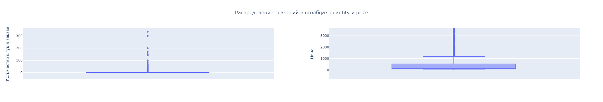
    


1. В столбце `quantity` заметно, что основная доля значений - 1 штука. Все остальные значения - аномальные. Виден плотный хвост значений от 2 и до 100 штук. 
2. Медианная цена товаров - 150 рублей. Основная доля значений расположилась в пределах от 9 до 1162 рублей за товар. Есть и выбросы до 15 тыс. рублей, но скорее всего это лишь дорогостоящие товары, существующие в магазине. 
3. Дополнительно посмотрим, какую долю составляют аномальные значения в столбце `quantity` и посмотрим, что это за товары в датасете. 


```python
# определим 99-й перцентиль
df.quantity.quantile(0.99)
```


    26.0


```python
df.query('quantity > 26').head(10)
```


<div>
<style scoped>
    .dataframe tbody tr th:only-of-type {
        vertical-align: middle;
    }

    .dataframe tbody tr th {
        vertical-align: top;
    }

    .dataframe thead th {
        text-align: right;
    }
</style>
<table border="1" class="dataframe">
  <thead>
    <tr style="text-align: right;">
      <th></th>
      <th>date</th>
      <th>customer_id</th>
      <th>order_id</th>
      <th>product</th>
      <th>quantity</th>
      <th>price</th>
      <th>dt</th>
      <th>month</th>
      <th>total_cost</th>
    </tr>
  </thead>
  <tbody>
    <tr>
      <th>13</th>
      <td>2018-10-01 15:00:00</td>
      <td>0948b0c2-990b-4a11-b835-69ac4714b21d</td>
      <td>68486</td>
      <td>крючок одежный 2-х рожковый серый металлик с полимерным покрытием *тонар*, 1110027</td>
      <td>96</td>
      <td>38.0</td>
      <td>2018-10-01</td>
      <td>2018-10</td>
      <td>3648.0</td>
    </tr>
    <tr>
      <th>144</th>
      <td>2018-10-08 15:00:00</td>
      <td>9151d307-654c-4239-a888-ada5ca45f0b2</td>
      <td>68571</td>
      <td>набор вешалок для костюма 45см 4шт цвет: кремовый, attribute, ahp224</td>
      <td>37</td>
      <td>202.0</td>
      <td>2018-10-08</td>
      <td>2018-10</td>
      <td>7474.0</td>
    </tr>
    <tr>
      <th>160</th>
      <td>2018-10-09 09:00:00</td>
      <td>c971fb21-d54c-4134-938f-16b62ee86d3b</td>
      <td>68580</td>
      <td>стяжка оконная с болтом ст-55 цинк, 1108354</td>
      <td>64</td>
      <td>19.0</td>
      <td>2018-10-09</td>
      <td>2018-10</td>
      <td>1216.0</td>
    </tr>
    <tr>
      <th>233</th>
      <td>2018-10-12 15:00:00</td>
      <td>4d93d3f6-8b24-403b-a74b-f5173e40d7db</td>
      <td>68623</td>
      <td>петля приварная гаражная d 14х90 мм с шаром, 1103003</td>
      <td>50</td>
      <td>38.0</td>
      <td>2018-10-12</td>
      <td>2018-10</td>
      <td>1900.0</td>
    </tr>
    <tr>
      <th>266</th>
      <td>2018-10-16 08:00:00</td>
      <td>cd09ea73-d9ce-48c3-b4c5-018113735e80</td>
      <td>68611</td>
      <td>крепеж для пружины дверной, 1107055</td>
      <td>150</td>
      <td>19.0</td>
      <td>2018-10-16</td>
      <td>2018-10</td>
      <td>2850.0</td>
    </tr>
    <tr>
      <th>267</th>
      <td>2018-10-16 08:00:00</td>
      <td>cd09ea73-d9ce-48c3-b4c5-018113735e80</td>
      <td>68611</td>
      <td>пружина дверная 240 мм оцинкованная (д-19 мм) без крепления, 1107014</td>
      <td>150</td>
      <td>38.0</td>
      <td>2018-10-16</td>
      <td>2018-10</td>
      <td>5700.0</td>
    </tr>
    <tr>
      <th>277</th>
      <td>2018-10-16 22:00:00</td>
      <td>42c5db22-6046-455b-a728-ff163a1b7808</td>
      <td>68667</td>
      <td>муляж красное яблоко мини полиуретан d-6 см</td>
      <td>30</td>
      <td>19.0</td>
      <td>2018-10-16</td>
      <td>2018-10</td>
      <td>570.0</td>
    </tr>
    <tr>
      <th>281</th>
      <td>2018-10-17 13:00:00</td>
      <td>4d93d3f6-8b24-403b-a74b-f5173e40d7db</td>
      <td>68668</td>
      <td>щетка для посуды *мила* sv3182 1807009</td>
      <td>50</td>
      <td>27.0</td>
      <td>2018-10-17</td>
      <td>2018-10</td>
      <td>1350.0</td>
    </tr>
    <tr>
      <th>282</th>
      <td>2018-10-17 13:00:00</td>
      <td>4d93d3f6-8b24-403b-a74b-f5173e40d7db</td>
      <td>68668</td>
      <td>щетка-утюжок с ручкой миди, standart, york, g1126</td>
      <td>50</td>
      <td>44.0</td>
      <td>2018-10-17</td>
      <td>2018-10</td>
      <td>2200.0</td>
    </tr>
    <tr>
      <th>568</th>
      <td>2018-11-01 08:00:00</td>
      <td>aa42dc38-780f-4b50-9a65-83b6fa64e766</td>
      <td>68815</td>
      <td>муляж яблоко 9 см красное</td>
      <td>170</td>
      <td>51.0</td>
      <td>2018-11-01</td>
      <td>2018-11</td>
      <td>8670.0</td>
    </tr>
  </tbody>
</table>
</div>


```python
# удалим тестовый заказ на 1000 единиц
df = df.query('quantity != 1000')
```

### Общее количество покупок


```python
print("Общее количество заказов:", len(df['order_id'].unique()))
```

    Общее количество заказов: 3465
    

### Общее количество уникальных пользователей


```python
print("Общее количество пользователей:", len(df['customer_id'].unique()))
```

    Общее количество пользователей: 2390
    

### Определение оптимального периода для анализа


```python
df['date'].describe(datetime_is_numeric=True)
```


    count                   5400
    mean     2019-05-06 15:16:24
    min      2018-10-01 00:00:00
    25%      2019-01-30 20:00:00
    50%      2019-04-29 13:00:00
    75%      2019-08-02 11:15:00
    max      2020-01-31 15:00:00
    Name: date, dtype: object


```python
display('Самая ранняя дата:',
       df['dt'].min())
display('Самая поздняя дата:',
       df['dt'].max())
print('Количество дней в датасете:', 
      str(df['dt'].max() - df['dt'].min()))
```


    'Самая ранняя дата:'


    datetime.date(2018, 10, 1)


    'Самая поздняя дата:'


    datetime.date(2020, 1, 31)


    Количество дней в датасете: 487 days, 0:00:00
    

Дополнительно посмотрим динамику продаж в течение указанного времени. Для этого построим сводную таблицу с количеством заказов каждый день. 


```python
daily_sales = df.pivot_table(index='month', values ='order_id', aggfunc = 'nunique')
```


```python
fig = px.line(daily_sales, y="order_id", title='Динамика продаж в интернет-магазине')

fig.update_yaxes(title_text="Количество заказов")
fig.update_xaxes(title_text="Месяц")
fig.update_layout(title_x=0.5)

#Вставляем статическую картинку для корректной загрузки проекта на гитхаб 
Image("C:/anaconda/Jupiter Notebook/Graphs/fig2.png", width=2000, height=1500)
```


    
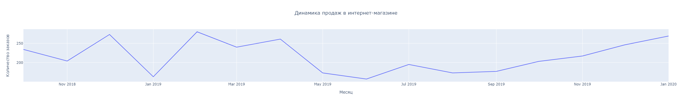
    


**Промежуточный вывод**
1. По графику можно заметить, что продажи в интернет-магазине распределены неравномерно. Бросаются в глаза 4 пика продаж - Декабрь 2018 года (273 заказа), Февраль 2019 года(280 заказов), Апрель 2019 года (261 заказ) и Январь 2020 года(269 заказов). 

### Общая выручка магазина


```python
# посчитаем общую выручку интернет-магазина
revenue_by_month = (df.pivot_table(index = 'month',
                                   values = 'total_cost',
                                   aggfunc = 'sum')
                    .reset_index()
                   )
total_revenue = round(sum(revenue_by_month['total_cost']))

print("Общая выручка интернет-магазина:", total_revenue, "рублей")
```

    Общая выручка интернет-магазина: 3861999 рублей
    


```python
# построим визуализацию динамики продаж
fig = px.line(revenue_by_month, x = 'month',y="total_cost", title='Общая выручка')

fig.update_yaxes(title_text="Выручка, руб.")
fig.update_xaxes(title_text="Месяц")
fig.update_layout(title_x=0.5)
#Вставляем статическую картинку для корректной загрузки проекта на гитхаб 
Image("C:/anaconda/Jupiter Notebook/Graphs/fig3.png", width=2000, height=1500)
```


    
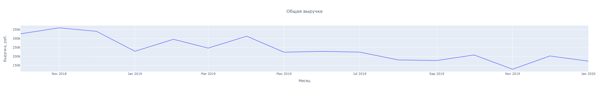
    


**Промежуточный вывод**
1. При общей выручке в 3,8 млн. рублей, месячная выручка лишь 3 месяца достигала показатель 300 тыс. - в ноябре 2018, феврале и апреле 2019. 
2. Самые активные продажи произошли в конце 2018 - начале 2019 года. После пикового апреля можно заметить плавное снижение продаж, достигая самых низких показателей в ноябре - 128 тыс. рублей. 
3. В конце года месячная выручка снова выросла до 200 тыс. 
4. Владельцам бизнеса стоит дополнительно обратить внимание на общую выручку и принять меры по ее увеличению. Общая тенденция - уменьшение объемов продаж. 

### Средний чек покупателя


```python
avg_profit = (df.pivot_table(index = ['dt', 'order_id'],
                                  values ='total_cost',
                                  aggfunc = 'sum')
              .reset_index()
             )
```


```python
print("Средний чек покупателя:", round(avg_profit['total_cost'].mean(), 1), "руб.")
```

    Средний чек покупателя: 1114.6 руб.
    


```python
avg_profit_by_day = avg_profit.pivot_table(index ='dt', values ='total_cost', aggfunc = {'mean', 'median'}).reset_index()
avg_profit_by_day['rolling_mean'] = avg_profit_by_day['mean'].rolling(window =5).mean()
avg_profit_by_day['rolling_median'] = avg_profit_by_day['median'].rolling(window =5).mean()
avg_profit_by_day
```


<div>
<style scoped>
    .dataframe tbody tr th:only-of-type {
        vertical-align: middle;
    }

    .dataframe tbody tr th {
        vertical-align: top;
    }

    .dataframe thead th {
        text-align: right;
    }
</style>
<table border="1" class="dataframe">
  <thead>
    <tr style="text-align: right;">
      <th></th>
      <th>dt</th>
      <th>mean</th>
      <th>median</th>
      <th>rolling_mean</th>
      <th>rolling_median</th>
    </tr>
  </thead>
  <tbody>
    <tr>
      <th>0</th>
      <td>2018-10-01</td>
      <td>917.888889</td>
      <td>674.0</td>
      <td>NaN</td>
      <td>NaN</td>
    </tr>
    <tr>
      <th>1</th>
      <td>2018-10-02</td>
      <td>1196.142857</td>
      <td>1012.5</td>
      <td>NaN</td>
      <td>NaN</td>
    </tr>
    <tr>
      <th>2</th>
      <td>2018-10-03</td>
      <td>1321.750000</td>
      <td>1254.5</td>
      <td>NaN</td>
      <td>NaN</td>
    </tr>
    <tr>
      <th>3</th>
      <td>2018-10-04</td>
      <td>2288.181818</td>
      <td>1409.0</td>
      <td>NaN</td>
      <td>NaN</td>
    </tr>
    <tr>
      <th>4</th>
      <td>2018-10-05</td>
      <td>672.666667</td>
      <td>351.5</td>
      <td>1279.326046</td>
      <td>940.3</td>
    </tr>
    <tr>
      <th>...</th>
      <td>...</td>
      <td>...</td>
      <td>...</td>
      <td>...</td>
      <td>...</td>
    </tr>
    <tr>
      <th>479</th>
      <td>2020-01-27</td>
      <td>262.333333</td>
      <td>89.0</td>
      <td>1139.349784</td>
      <td>714.6</td>
    </tr>
    <tr>
      <th>480</th>
      <td>2020-01-28</td>
      <td>757.125000</td>
      <td>225.0</td>
      <td>1019.389069</td>
      <td>650.2</td>
    </tr>
    <tr>
      <th>481</th>
      <td>2020-01-29</td>
      <td>911.833333</td>
      <td>880.5</td>
      <td>977.512879</td>
      <td>676.5</td>
    </tr>
    <tr>
      <th>482</th>
      <td>2020-01-30</td>
      <td>339.666667</td>
      <td>76.0</td>
      <td>645.246212</td>
      <td>291.5</td>
    </tr>
    <tr>
      <th>483</th>
      <td>2020-01-31</td>
      <td>195.333333</td>
      <td>128.0</td>
      <td>493.258333</td>
      <td>279.7</td>
    </tr>
  </tbody>
</table>
<p>484 rows × 5 columns</p>
</div>


```python
# построим визуализацию динамику изменений среднего чека покупателей
fig = px.line(avg_profit_by_day,
              x = 'dt',
              y=['rolling_mean', 'rolling_median'],
              title='Средний чек покупателей',
              labels={
                  "value": "Стоимость покупки, руб.",
                  "dt": "Месяц",
                  "variable": "Тип чека"
              },
              )
fig.update_traces(
    name="Средний чек",
    selector=dict(name="rolling_mean")
)

fig.update_traces(
    name="Медианный чек", 
    selector=dict(name="rolling_median")
)

fig.update_layout(title_x=0.5)

#Вставляем статическую картинку для корректной загрузки проекта на гитхаб 
Image("C:/anaconda/Jupiter Notebook/Graphs/fig4.png", width=2000, height=1500)
```


    
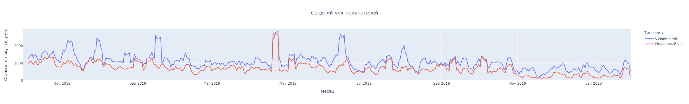
    


**Промежуточный вывод**
1. Средний чек покупателя составил 1114.6 руб
2. Медианный чек ожидаемо стабильно ниже среднего чека пользователей. 
3. Обе линии имеют тенденцию к снижению. Если в конце 2018 - начале 2019 года средний чек находился в диапазоне от 1000 до 2500, то к концу 2019 года средний чек был в пределах 400-1000 рублей. 

### Среднее количество продуктов в заказе


```python
# сгруппируем данные по номеру заказа
order_pivot = (df.pivot_table(index = 'order_id',
                              values = 'quantity',
                              aggfunc = {'count', 'sum'})
               .reset_index()
               )
```


```python
print("Среднее количество позиций в заказах:", round(order_pivot['count'].mean()))
print("Среднее количество товаров в заказах:", round(order_pivot['sum'].mean()))
```

    Среднее количество позиций в заказах: 2
    Среднее количество товаров в заказах: 4
    

### Самые популярные товары интернет-магазина


```python
# проверим, какие товары покупают чаще всего 
top_products = (df.pivot_table(index ='product',
                values = 'order_id',
                aggfunc = 'nunique')
 .reset_index()
 .sort_values(by ='order_id',
              ascending= False)
 .head(15)
)

# построим визуализацию, какие товары покупают чаще всего
fig = px.bar(
    top_products,
    y='product',
   x='order_id',
    labels={'product': 'Название товара', 'order_id': 'Количество покупок'},
    title='Топ-15 востребуемых товаров интернет-магазина',
)

fig.update_layout(title_x=0.5, showlegend=True)
fig.update_layout(barmode='stack', yaxis={'categoryorder':'total ascending'})

#Вставляем статическую картинку для корректной загрузки проекта на гитхаб 
Image("C:/anaconda/Jupiter Notebook/Graphs/fig5.png", width=2000, height=1500)
```


    
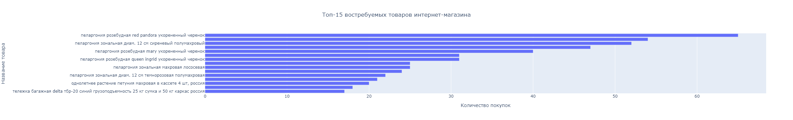
    


1. В конкретном случае мы хотели посмотреть на частоту покупок конкретных товаров, без привязки к количеству штук.  
2. Даже без предварительной категоризации товаров заметно, что из топ-15 товаров, абсолютное большинство - разновидности Пеларгонии (рассада). Видимо в нашем интернет-магазине очень выгодная цена на этот товар по сравнению с конкурентами. 
3. Помимо рассады, чаще всего у нас покупали сумки-тележки - 47 и 17 покупок соответственно. 

Теперь посмотрим, какие товары покупали *больше всего*.


```python
# проверим, какие товары покупают больше всего 
top_quantity_products = (df.pivot_table(index ='product',
                values = 'quantity',
                aggfunc = 'sum')
 .reset_index()
 .sort_values(by ='quantity',
              ascending= False)
 .head(15)
)

# построим визуализацию, какие товары покупают чаще всего
fig = px.bar(
    top_quantity_products,
    y='product',
   x='quantity',
    labels={'product': 'Название товара', 'quantity': 'Количество проданных единиц'},
    title='Топ-15 популярных товаров интернет-магазина',
)

fig.update_layout(title_x=0.5, showlegend=True)
fig.update_layout(barmode='stack', yaxis={'categoryorder':'total ascending'})

#Вставляем статическую картинку для корректной загрузки проекта на гитхаб 
Image("C:/anaconda/Jupiter Notebook/Graphs/fig6.png", width=2000, height=1500)
```


    
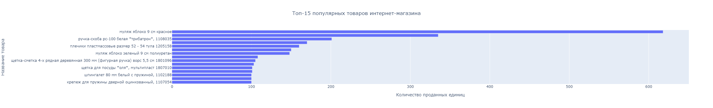
    


1. Список топ-15 популярных товаров по количеству купленных единиц отличается от нашего предыдущего списка по частоте покупок. В лидерах теперь скорее товары для дома - муляжи, вешалки, плечики (618, 335, 160 единиц). 
2. Категория рассада совсем не встречается в нашем списке. 

### Самые прибыльные товары для компании

Ранее мы уде просмотрели, какие товары покупают больше и чаще всего. Вполне возможно, что основная выручка компании формируется за счет совсем других товарных позиций и именно на них нужно будет в будущем сделать упор в маркетинговой стратегии. 
Мы заметили, что чаще всего в нашем интернет-магазине покупают рассаду. Цена одной единицы - максимум 200 рублей. При этом мы также знаем, что в средняя цена товара в нашем магазине - 534 рубля. 

Проведем минимальный ABC-анализ и посмотрим, какие товары генерируют 80% нашей выручки. 


```python
# проранжируем товары по количеству принесенной выручки
top_revenue_products = (df.pivot_table(index ='product',
                                            values = ['total_cost', 'quantity'],
                                            aggfunc = 'sum')
                        .reset_index()
                        .sort_values(by ='total_cost', ascending= False)
)
total_rev = top_revenue_products['total_cost'].sum()

# посчитаем, какой процент выручки приходится на каждый товар в ассортименте
top_revenue_products['share'] = top_revenue_products['total_cost'] / total_rev * 100
top_revenue_products = top_revenue_products.sort_values(by ='share', ascending= False)

# посчитаем кумулятивную сумму доли выручки
top_revenue_products['cum_sum'] = top_revenue_products['share'].cumsum()

# присвоим категории A-B-C для списка товаров, запишем в отдельный список
category_A_products = top_revenue_products.query('cum_sum < 80')['product'].to_list()
category_B_products = top_revenue_products.query('80 <= cum_sum < 95')['product'].to_list()
category_C_products = top_revenue_products.query('95 <= cum_sum')['product'].to_list()
```


```python
# покажем разбивку товаров каждой категории
print('Общее кол-во товаров:',
      len(top_revenue_products))

print('Кол-во товаров, которые принесли 80% годовой выручки, Категория А:',
      len(top_revenue_products.query('cum_sum < 80')))

print('Доля товаров Категории А:',
      round(len(top_revenue_products.query('cum_sum < 80')) / 
            len(top_revenue_products) * 100), "%")
print("--------------")
print('Кол-во товаров, которые принесли 15% годовой выручки, Категория B:',
      len(top_revenue_products.query('80 <= cum_sum < 95')))

print('Доля товаров Категории В:',
      round(len(top_revenue_products.query('80 <= cum_sum < 95')) / 
            len(top_revenue_products) * 100), "%")

print("--------------")

print('Кол-во товаров, которые принесли 5% годовой выручки, Категория С:',
      len(top_revenue_products.query('95 <= cum_sum')))

print('Доля товаров Категории С:',
      round(len(top_revenue_products.query('95 <= cum_sum')) / 
            len(top_revenue_products) * 100), "%")
```

    Общее кол-во товаров: 2300
    Кол-во товаров, которые принесли 80% годовой выручки, Категория А: 613
    Доля товаров Категории А: 27 %
    --------------
    Кол-во товаров, которые принесли 15% годовой выручки, Категория B: 683
    Доля товаров Категории В: 30 %
    --------------
    Кол-во товаров, которые принесли 5% годовой выручки, Категория С: 1004
    Доля товаров Категории С: 44 %
    

1. Из всего списка товаров только 27% принесли 80% всей выручки. Данный список товаров можно отнести к категории "A". Такие товары выгоднее всего продавать и на их реализации можно будет в будущем сконцентрироваться. 
2. К категории "В" можно отнести товары, которые принесли компании - 15% всей выручки (кумулятивная доля 80-95%). 
3. К категории "С" можно отнести товары, которые принесли компании всего 5% всей выручки. В будущем нужно будет разбираться либо почему эти позиции так плохо продаются и корректировать стратегию продаж, либо выводить эти товары из реализации. 


```python
def categorize_product(df_row):
    if df_row['product'] in category_A_products:
        return "A"
    elif df_row['product'] in category_B_products:
        return "B"
    elif df_row['product'] in category_C_products:
        return "C"
    else:
        return "Unknown"

df['category_abc'] = df.apply(categorize_product, axis=1)
```


```python
# проверим, какие товары покупают чаще всего с учетом категорий
top_products = (df.pivot_table(index =['product', 'category_abc'],
                values = 'order_id',
                aggfunc = 'nunique')
 .reset_index()
 .sort_values(by ='order_id',
              ascending= False)
 .head(15)
)

# построим визуализацию, какие товары покупают чаще всего
fig = px.bar(
    top_products,
    y='product',
   x='order_id',
    color = 'category_abc',
    labels={'product': 'Название товара', 'order_id': 'Количество покупок'},
    title='Топ-15 востребуемых товаров интернет-магазина',
)

fig.update_layout(title_x=0.5, showlegend=True)
fig.update_layout(barmode='stack', yaxis={'categoryorder':'total ascending'})

#Вставляем статическую картинку для корректной загрузки проекта на гитхаб 
Image("C:/anaconda/Jupiter Notebook/Graphs/fig7.png", width=2000, height=1500)
```


    
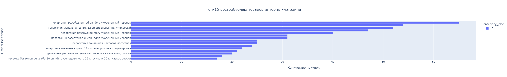
    


```python
# проверим, какие товары покупают больше всего с учетом категорий
top_quantity_products = (df.pivot_table(index =['product', 'category_abc'],
                values = 'quantity',
                aggfunc = 'sum')
 .reset_index()
 .sort_values(by ='quantity',
              ascending= False)
 .head(15)
)

# построим визуализацию, какие товары покупают чаще всего
fig = px.bar(
    top_quantity_products,
    y='product',
   x='quantity',
    color = 'category_abc',
    labels={'product': 'Название товара', 'quantity': 'Количество проданных единиц'},
    title='Топ-15 популярных товаров интернет-магазина',
)

fig.update_layout(title_x=0.5, showlegend=True)
fig.update_layout(barmode='stack', yaxis={'categoryorder':'total ascending'})

#Вставляем статическую картинку для корректной загрузки проекта на гитхаб 
Image("C:/anaconda/Jupiter Notebook/Graphs/fig8.png", width=2000, height=1500)
```


    

    


Как и предполагалось, большинство наших самых популярных и востребованных товаров относятся к категории А.

### Средняя частота покупок 


```python
frequency_user = df.pivot_table(index = 'customer_id', values = 'order_id', aggfunc = 'nunique')
frequency_user['order_id'].describe()
```


    count    2390.000000
    mean        1.449791
    std         2.710187
    min         1.000000
    25%         1.000000
    50%         1.000000
    75%         2.000000
    max       126.000000
    Name: order_id, dtype: float64


Стандартный покупатель интернет-магазина в среднем делает 1-2 покупки. 
Однако есть и по-настоящему лояльные покупатели, кто за год наблюдений совершил до 125 покупок. 


```python
print("Вернулись хотя бы 1 раз:", frequency_user.query('order_id > 1')['order_id'].count(), "покупателей")
print("Доля повторных покупателей:", round(frequency_user.query('order_id > 1')['order_id'].count() / frequency_user['order_id'].count() *100, 2))

print("Лояльная база интернет-магазина:", frequency_user.query('order_id > 2')['order_id'].count(), "покупателей")
```

    Вернулись хотя бы 1 раз: 870 покупателей
    Доля повторных покупателей: 36.4
    Лояльная база интернет-магазина: 28 покупателей
    

Дополнительно посмотрим, сколько в среднем проходит дней между покупками. 


```python
df.sort_values(by=['customer_id', 'dt'], inplace=True)
df['time_difference'] = df.groupby('customer_id')['date'].diff()
df['time_difference'] = df['time_difference'].dt.days
df.query('time_difference > 0 ')['time_difference'].describe()
```


    count    864.000000
    mean     221.261574
    std      116.479057
    min        1.000000
    25%      145.000000
    50%      262.000000
    75%      304.000000
    max      395.000000
    Name: time_difference, dtype: float64


1. В среднем между повторными покупками покупателей проходит 221 день. Медианное число - 262 дня. 
Это значит, что наш "типичный" покупатель, если и возвращается за повторной покупкой, то минимум через полгода, а то и дольше. Скорее всего его интересуют конкретные сезонные товары, которые он покупает каждый год. 

В таком случае бизнесу стоило бы дополнительно проработать стратегию по удержанию пользователей. Проанализировать возможности проведения акций, которые бы участили визиты пользователей на сайт. 

### Общий вывод по разделу

1. В нашем распоряжении оказались данные о 3465 заказах и 2390 уникальных пользователей. Период исследования - 1 октября 2018 - 31 января 2020 года. 
2. При общей выручке в 3,8 млн. рублей, месячная выручка лишь 3 месяца достигала показатель 300 тыс. - в ноябре 2018, феврале и апреле 2019. Самые активные продажи произошли в конце 2018 - начале 2019 года. После пикового апреля можно заметить плавное снижение продаж, достигая самых низких показателей в ноябре - 128 тыс. рублей. **Общая тенденция - уменьшение объемов продаж.**

3. Средний чек покупателя в 2019 году составил 1114.6 руб. **Общий тренд - снижение среднего чека в течение года.** Если в конце 2018 - начале 2019 года средний чек находился в диапазоне от 1000 до 2500, то к концу 2019 года средний чек был в пределах 400-1000 рублей.

4. Чаще всего в интернет-магазине покупают вариации рассады. Однако топ-15 товаров по количеству купленных единиц отличается от нашего предыдущего списка по частоте покупок.  В лидерах теперь скорее товары для дома - муляжи, вешалки, плечики (618, 335, 160 единиц).

5. Мы также провели ABC-анализ, который показал, что 27% товарного ассортимента магазина приносят компании 80% всей выручки (Категория А). Такие товары выгоднее всего продавать и на их реализации можно будет в будущем сконцентрироваться. 43% товарного ассортимента принесли компании всего 5% всей выручки. В будущем нужно будет разбираться либо почему эти позиции так плохо продаются и корректировать стратегию продаж, либо выводить эти товары из реализации. Мы сохранили категории товаров в отдельные списки, которые в дальнейшем можно будет передать маркетинговому отделу. 

6. Стандартный покупатель интернет-магазина в среднем делает 1-2 покупки.

7. В среднем между повторными покупками покупателей проходит 221 день. Медианное число - 262 дня. Это значит, что наш "типичный" покупатель, если и возвращается за повторной покупкой, то минимум через полгода, а то и дольше. 

**Общие рекомендации для интернет-магазина**
1. обратить внимание на снижающиеся объемы продаж, а также на снижение среднего чека в течение всего года. 
2. Проанализировать товарный аcсортимент категории С - принять решение по стратегии продаж. 
3. Дополнительно проработать стратегию по удержанию пользователей. Проанализировать возможности проведения акций, которые бы участили визиты пользователей на сайт.

## Сегментация пользователей

Ранее мы смотрели усредненные показатели пользователей: сколько в среднем наш покупатель делает покупок, сколько примерно тратит за 1 заказ, как быстро возвращается за повторной покупкой. Однако усредненный показатель не помогает строить более персонализированный подход к покупателям. Для этого нам потребуется для начала сегментировать покупателей на базе RFM-анализа. 

RFM-анализ позволяет сегментировать клиентов по частоте и сумме покупок и выявлять тех клиентов, которые приносят больше денег. С каждой группой в дальнейшем можно строить отдельные коммуникации: давать им разную рекламу и делать разные email-рассылки. 

###  RFM-анализ


```python
# запишем максимальную дату анализа
snapshot_date = df['dt'].max() + timedelta(days=1)
print(snapshot_date)

# сгруппируем датафрейм по каждому пользователю
grouped_df = (df.groupby(['customer_id'])
              .agg({'dt': lambda x: (snapshot_date - x.max()).days,
                    'order_id': 'nunique',
                    'total_cost': 'sum'})
             )
# переименуем колонки
grouped_df.rename(columns={'dt': 'recency',
                           'order_id': 'frequency',
                           'total_cost': 'monetary'},
                  inplace=True)

```

    2020-02-01
    


```python
# выведем шапку обновленного датафрейма
print(grouped_df.head())
print('{:,} rows; {:,} columns'
      .format(grouped_df.shape[0], grouped_df.shape[1]))
```

                                          recency  frequency  monetary
    customer_id                                                       
    000d6849-084e-4d9f-ac03-37174eaf60c4      108          1     555.0
    001cee7f-0b29-4716-b202-0042213ab038      350          1     442.0
    00299f34-5385-4d13-9aea-c80b81658e1b      110          1     914.0
    002d4d3a-4a59-406b-86ec-c3314357e498      370          1    1649.0
    003bbd39-0000-41ff-b7f9-2ddaec152037      125          1    2324.0
    2,390 rows; 3 columns
    


```python
# определим, какое распределение частоты покупок в столбце frequency
grouped_df['frequency'].value_counts()
```


    1      1520
    2       842
    3        20
    4         4
    35        1
    17        1
    7         1
    126       1
    Name: frequency, dtype: int64


```python
# определим функцию, которая вручную распределим баллы в зависимости от частоты покупок
def get_f(x):
    if x == 1:
        return 1
    if x in [2]:
        return 2
    if x in [3]:
        return 3
    return 4 
```


```python
grouped_df['F'] = grouped_df['frequency'].apply(get_f)
```


```python
# посмотрим, как сработало наше распределение
grouped_df.groupby('F')['frequency'].agg(['mean','count'])
```


<div>
<style scoped>
    .dataframe tbody tr th:only-of-type {
        vertical-align: middle;
    }

    .dataframe tbody tr th {
        vertical-align: top;
    }

    .dataframe thead th {
        text-align: right;
    }
</style>
<table border="1" class="dataframe">
  <thead>
    <tr style="text-align: right;">
      <th></th>
      <th>mean</th>
      <th>count</th>
    </tr>
    <tr>
      <th>F</th>
      <th></th>
      <th></th>
    </tr>
  </thead>
  <tbody>
    <tr>
      <th>1</th>
      <td>1.000</td>
      <td>1520</td>
    </tr>
    <tr>
      <th>2</th>
      <td>2.000</td>
      <td>842</td>
    </tr>
    <tr>
      <th>3</th>
      <td>3.000</td>
      <td>20</td>
    </tr>
    <tr>
      <th>4</th>
      <td>25.125</td>
      <td>8</td>
    </tr>
  </tbody>
</table>
</div>


Нам не удалось равномерно разделить колонку на 4 категории, так как практически половину записей о клиентах, которые совершили всего 1 покупку. Им мы выставили 1 балл. По остаточному принципу мы распределили 3 группы в зависимости от частоты их покупок. 


```python
# расчет показателя recency. Чем более недавно, тем лучше
grouped_df['R'] = 5 - (pd.qcut(grouped_df['recency'], 4, labels=False) + 1)
```


```python
# расчет показателя monetary. Чем больше, тем лучше
grouped_df['M'] = pd.qcut(grouped_df['monetary'], 4, labels=False) + 1
```


```python
# расчет общего rfm-score
grouped_df['rfm_score'] = grouped_df['R'] + grouped_df['F'] + grouped_df['M']
```


```python
# функция для определения сегмента пользователей в зависимости от rfm-score
def rfm_level(df):
    if df['rfm_score'] >= 9:
        return 'Не можем их потерять'
    elif (df['rfm_score'] >= 8) and (df['rfm_score'] < 9):
        return 'Чемпионы'
    elif (df['rfm_score'] >= 7) and (df['rfm_score'] < 8):
        return 'Лояльные'
    elif (df['rfm_score'] >= 6) and (df['rfm_score'] < 7):
        return 'Потенциальные'
    elif (df['rfm_score'] >= 5) and (df['rfm_score'] < 6):
        return 'Перспективные'
    elif (df['rfm_score'] >= 4) and (df['rfm_score'] < 5):
        return 'Необходимо внимание'
    else:
        return 'Необходима активация'
```


```python
grouped_df['segment'] = grouped_df.apply(rfm_level,axis=1)
grouped_df = grouped_df.reset_index()

# перенесем список id пользователей с присвоенным сегментом
champ_list = grouped_df.query('segment == "Чемпионы"')['customer_id'].to_list()
cant_lose_list = grouped_df.query('segment == "Не можем их потерять"')['customer_id'].to_list()
loyal_list = grouped_df.query('segment == "Лояльные"')['customer_id'].to_list()
potential_list = grouped_df.query('segment == "Потенциальные"')['customer_id'].to_list()
promising_list = grouped_df.query('segment == "Перспективные"')['customer_id'].to_list()
attention_list = grouped_df.query('segment == "Необходимо внимание"')['customer_id'].to_list()
activation_list = grouped_df.query('segment == "Необходима активация"')['customer_id'].to_list()

# сделаем запись о сегментах в основном дф
for index, row in df.iterrows():
    if row['customer_id'] in champ_list:
        df.at[index, 'segment'] = 'Чемпионы'
    elif row['customer_id'] in cant_lose_list:
        df.at[index, 'segment'] = 'Не можем их потерять'
    elif row['customer_id'] in loyal_list:
        df.at[index, 'segment'] = 'Лояльные'
    elif row['customer_id'] in potential_list:
        df.at[index, 'segment'] = 'Потенциальные'
    elif row['customer_id'] in promising_list:
        df.at[index, 'segment'] = 'Перспективные'
    elif row['customer_id'] in attention_list:
        df.at[index, 'segment'] = 'Необходимо внимание'
    elif row['customer_id'] in activation_list:
        df.at[index, 'segment'] = 'Необходима активация'    
```


```python
rfm_level_agg = grouped_df.groupby('segment').agg({
    'recency': 'mean',
    'frequency': 'mean',
    'monetary': ['mean','sum', 'count']
}).round().reset_index()

rfm_level_agg.columns = [col[0] for col in rfm_level_agg.columns]
rfm_level_agg.columns = ['segment', 'recency', 'frequency', 'monetary', 'total_revenue', 'segment_count']
rfm_level_agg = rfm_level_agg.sort_values('total_revenue', ascending = False)
```


```python
# построим общую визуализацию сегментов 
fig = px.treemap(rfm_level_agg,
                 path=['segment'],
                 hover_data = ['recency', 'frequency', 'segment_count'],
                 values='monetary',
                 title='Сегментация пользователей на базе RFM-анализа', 
                 labels={'segment': 'Название сегмента'})
fig.update_layout(title_x=0.5)

#Вставляем статическую картинку для корректной загрузки проекта на гитхаб 
Image("C:/anaconda/Jupiter Notebook/Graphs/fig9.png", width=2000, height=1500)
```


    

    


```python
# построим визуализацию общей выручки, приносимой каждым сегментом пользователей
fig = px.bar(
    rfm_level_agg,
    y='total_revenue',
    x='segment',
    labels={'total_revenue': 'Объем выручки, млн. руб.', 'segment': 'Название RMF-сегмента'},
    title='Общая выручка интернет магазина с разбивкой по сегментам пользователей',
)

fig.add_trace(
    go.Scatter(x=rfm_level_agg['segment'], y=rfm_level_agg['segment_count'], mode='lines', name='Размер сегмента', yaxis='y2')
)
fig.update_layout(
    yaxis2=dict(overlaying='y',side='right'),
    title_x=0.5,
    showlegend=True,
    barmode='stack'
)

#Вставляем статическую картинку для корректной загрузки проекта на гитхаб 
Image("C:/anaconda/Jupiter Notebook/Graphs/fig10.png", width=2000, height=1500)
```


    
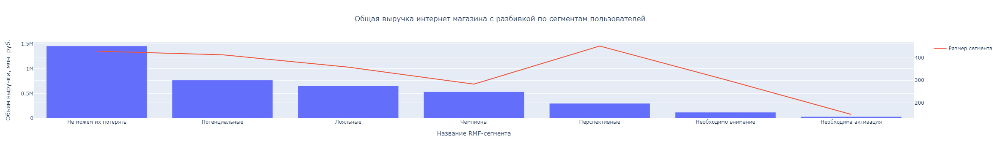
    


```python
rfm_level_agg = rfm_level_agg.sort_values(by = 'monetary', ascending = False)
fig = px.bar(
    rfm_level_agg,
    y='monetary',
    x='segment',
    labels={'monetary': 'Средняя выручка с клиента, руб.', 'segment': 'Название RMF-сегмента'},
    title='Средняя выручка с пользователя интернет-магазина с разбивкой по сегментам пользователей',
)

fig.add_trace(
    go.Scatter(x=rfm_level_agg['segment'], y=rfm_level_agg['recency'], mode='lines', name='Средняя давность покупок', yaxis='y2')
)
fig.update_layout(
    yaxis2=dict(overlaying='y',side='right'),
    title_x=0.5,
    showlegend=True,
    barmode='stack'
)

#Вставляем статическую картинку для корректной загрузки проекта на гитхаб 
Image("C:/anaconda/Jupiter Notebook/Graphs/fig11.png", width=2000, height=1500)
```


    
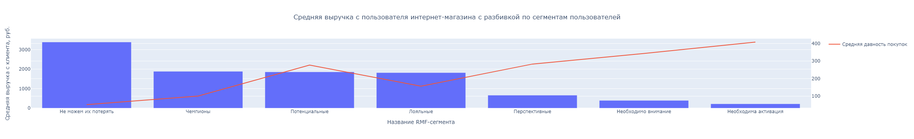
    


**Промежуточный вывод**
1. Мы провели RFM-анализ покупателей интернет-магазина. Благодаря анализу мы смогли сегментировать 7 групп пользователей, к каждой из которых можно применять персонализированный подход в продажах (подробнее в общих выводах).   
2. Благодаря графику общей выручки с разбивкой по сегментам, можно заметить, что практически половину всей выручки компании обеспечивает сегмент "Не можем их потерять" - 1,4 млн рублей. Меньше всего прибыли приносит сегмент "Необходима активация" - 32 тыс. рублей.
3. Средняя выручка с клиента также пропорциональна выделенным сегментам. Больше всего тратят пользователи сегмента "Не можем их потерять" - в среднем 3 тыс. рублей. меньше всего "Необходима активация" - не более 200 рублей. Последние скорее всего пришли за одной мелкой покупкой и больше не возвращались. 
4. Показатель "recency" обратно пропорционален выделенным сегментам. Наши лидеры в среднем возвращаются за 52 дня за повторной покупкой, в то время как последний сегмент - более чем за 1 год.

### Определение товарных категорий


```python
# напишем функцию, которая выделяет первые 2 слова из колонки
def extract_category(input_string):
    words = input_string.split()
    return ' '.join(words[:3])
```


```python
# применим функцию к нашему дф
df['product_new'] = df['product'].apply(extract_category)
df.head()
```


<div>
<style scoped>
    .dataframe tbody tr th:only-of-type {
        vertical-align: middle;
    }

    .dataframe tbody tr th {
        vertical-align: top;
    }

    .dataframe thead th {
        text-align: right;
    }
</style>
<table border="1" class="dataframe">
  <thead>
    <tr style="text-align: right;">
      <th></th>
      <th>date</th>
      <th>customer_id</th>
      <th>order_id</th>
      <th>product</th>
      <th>quantity</th>
      <th>price</th>
      <th>dt</th>
      <th>month</th>
      <th>total_cost</th>
      <th>category_abc</th>
      <th>time_difference</th>
      <th>segment</th>
      <th>product_new</th>
    </tr>
  </thead>
  <tbody>
    <tr>
      <th>6618</th>
      <td>2019-10-16 08:00:00</td>
      <td>000d6849-084e-4d9f-ac03-37174eaf60c4</td>
      <td>14943</td>
      <td>пеларгония зональная диам. 12 см темнорозовая полумахровая</td>
      <td>1</td>
      <td>150.0</td>
      <td>2019-10-16</td>
      <td>2019-10</td>
      <td>150.0</td>
      <td>A</td>
      <td>NaN</td>
      <td>Потенциальные</td>
      <td>пеларгония зональная диам.</td>
    </tr>
    <tr>
      <th>6619</th>
      <td>2019-10-16 08:00:00</td>
      <td>000d6849-084e-4d9f-ac03-37174eaf60c4</td>
      <td>14943</td>
      <td>пеларгония розебудная queen ingrid укорененный черенок</td>
      <td>1</td>
      <td>135.0</td>
      <td>2019-10-16</td>
      <td>2019-10</td>
      <td>135.0</td>
      <td>A</td>
      <td>0.0</td>
      <td>Потенциальные</td>
      <td>пеларгония розебудная queen</td>
    </tr>
    <tr>
      <th>6620</th>
      <td>2019-10-16 08:00:00</td>
      <td>000d6849-084e-4d9f-ac03-37174eaf60c4</td>
      <td>14943</td>
      <td>пеларгония розебудная rosebud red d-7 см</td>
      <td>1</td>
      <td>135.0</td>
      <td>2019-10-16</td>
      <td>2019-10</td>
      <td>135.0</td>
      <td>A</td>
      <td>0.0</td>
      <td>Потенциальные</td>
      <td>пеларгония розебудная rosebud</td>
    </tr>
    <tr>
      <th>6621</th>
      <td>2019-10-16 08:00:00</td>
      <td>000d6849-084e-4d9f-ac03-37174eaf60c4</td>
      <td>14943</td>
      <td>пеларгония тюльпановидная emma</td>
      <td>1</td>
      <td>135.0</td>
      <td>2019-10-16</td>
      <td>2019-10</td>
      <td>135.0</td>
      <td>A</td>
      <td>0.0</td>
      <td>Потенциальные</td>
      <td>пеларгония тюльпановидная emma</td>
    </tr>
    <tr>
      <th>1842</th>
      <td>2019-02-16 11:00:00</td>
      <td>001cee7f-0b29-4716-b202-0042213ab038</td>
      <td>70290</td>
      <td>сушилка для белья потолочная лиана люкс 150 см ллп-150</td>
      <td>1</td>
      <td>442.0</td>
      <td>2019-02-16</td>
      <td>2019-02</td>
      <td>442.0</td>
      <td>C</td>
      <td>NaN</td>
      <td>Необходимо внимание</td>
      <td>сушилка для белья</td>
    </tr>
  </tbody>
</table>
</div>


```python
display(len(df['product'].unique()))
len(df['product_new'].unique())
```


    2300


    1374


Таким образом мы убрали ненужные детали из описания товара - марку, артикул, размер и т.д. Количество уникальных названий сократилось с 2,2 тыс. до 1374 шт.


```python
df['product_new'].value_counts()
```


    сушилка для белья                 292
    пеларгония зональная диам.        272
    рассада зелени для                226
    герань домашняя (пеларгония       112
    сумка-тележка 2-х колесная         98
                                     ... 
    чехол для платья                    1
    муляж перец болгарский              1
    отбеливатель пероксоль лилия-м      1
    салатник романтик гарден            1
    чайник заварочный стеклянный        1
    Name: product_new, Length: 1374, dtype: int64


```python
# напишем функцию, которая определит названия товаров по категориям
def product_category(df_row):
    flowers_list = ['пеларгония','укроп','мимоза', 'вербейник','вербена','алиссум','хризантема','гардения', 'бегония', 'аптения', 'антуриум','азалия', 'тимьян','рукола', 'петрушк', 'капуста', 'гвоздика','афеляндра', 'хлорофит','бальзамин', 'арбуз', 'мята','колокольчик', 'дыня',  'цикламен', 'флокс', 'циперу','фиалка', 'примула', 'рассада','котовник','овсянниц', 'томат', 'помидор', 'пуансеттия', 'настурция', 'герань', 'фуксия','эвкалипт', 'растение', 'роза', 'бакопа', 'петуния', 'калибрахоа', 'базилик', 'зелен', 'огурец', 'горшк', 'кашпо']
    decor_list = ['искусственн','подарочн','декор','ваза', 'муляж', 'новогодн', 'штора', 'штор', 'карниз']
    bath_list = ['ванна','мыло', 'корзина', 'ванн', 'белья', 'ёрш','ерш','зубна', 'туалет', 'унитаз','стирк', 'мыла', 'таз', 'тряпкодержатель', 'вантуз']
    house_list = ['сушилка', 'ящик','ковёр', 'мытья','перчатки','окон', 'весы напольные', 'совок','веник','подрукавник', 'вешал','чистк', 'окномойка', 'ковер', 'одежды', 'коврик', 'чехол', 'гладильн', 'вешалк', 'плечик', 'кофр', 'щетк', 'швабра']
    kitchen_list = ['чайник','салфет','сито', 'нож','измельчитель', 'ложка','кухон', 'кухн', 'выпечк', 'посуд','бокал', 'масленка', 'сахар','скалк','миксер', 'соковыжималк', 'стакан', 'разделочн', 'бульон', 'блюдо', 'кастрюля', 'холодца', 'вилка', 'миска','блюдце', 'хлебница', 'чайный', 'муки', 'термос','фужер', 'салатн', 'банка', 'свч', 'салфетк', 'тарелка', 'кувшин', 'кружк', 'терка', 'овощеварка','сковород',  'продукт']
    textile_list = ['скатерть', 'простынь', 'ткань', 'полотен', 'одеяло', 'простын', 'халат', 'покрывал', 'плед']
    storage_list = ['сумка', 'тележк', 'стремянк','обув', 'крючок', 'мешок', 'хранен', 'ведро','ведр', 'коробка', 'лестница','прищеп', 'мусор','урна', 'полки', 'подставка', 'этажерка']
    
    for name in flowers_list:
        if name in df_row['product_new']:
            return 'Растения и рассада'

    for name in bath_list:
        if name in df_row['product_new']:
            return 'Товары для ванной'
        
    for name in decor_list:
        if name in df_row['product_new']:
            return 'Декор'
    
    for name in house_list:
        if name in df_row['product_new']:
            return 'Товары для дома'

    for name in kitchen_list:
        if name in df_row['product_new']:
            return 'Товары для кухни'        
        
    for name in textile_list:
        if name in df_row['product_new']:
            return 'Текстиль'

    for name in storage_list:
        if name in df_row['product_new']:
            return 'Хранение'
        
    return 'Другое'
```


```python
# применяем функцию и создаем отдельный столбец с категориями
df['category'] = df.apply(product_category, axis = 1)
```


```python
df['category'].value_counts()
```


    Растения и рассада    2446
    Товары для ванной      621
    Товары для дома        613
    Хранение               529
    Другое                 450
    Товары для кухни       381
    Декор                  295
    Текстиль                65
    Name: category, dtype: int64


По предварительному осмотру распределилось более 90% всего датасета. Оставшаяся часть перешла в категорию "Другое". 
После кластеризации становится заметно, что более половины всего датасета занимает категория "Растения и рассада". 

Необходимо посмотреть, какие категории приносят интернет-магазину больше всего выручки


```python
df_grouped = (df.pivot_table(index = ['category', 'category_abc'], values = 'total_cost', aggfunc = 'sum')
              .reset_index()
              .sort_values(by = ['total_cost', 'category'], ascending = False)
)

# строим визуализацию 
fig = px.bar(
    df_grouped,
    y='total_cost',
    x='category',
    color = 'category_abc',
    labels={'total_cost': 'Общая выручка, млн. руб.', 'category': 'Категории товаров', 'category_abc': 'Группы товаров'},
    title='Распределение выручки по категориям товаров',
)

fig.update_layout(title_x=0.5, showlegend=True)
fig.update_layout(barmode='stack', yaxis={'categoryorder':'total descending'})

#Вставляем статическую картинку для корректной загрузки проекта на гитхаб 
Image("C:/anaconda/Jupiter Notebook/Graphs/fig12.png", width=2000, height=1500)
```


    
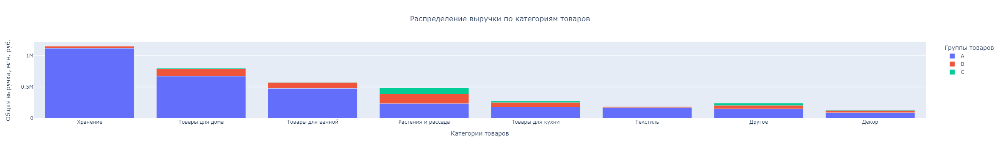
    


1. Больше всего выручки приносит категория Хранение - более 1,1 млн. рублей. И именно в этой категории больше всего прибыль от товаров группы А. 
2. Несмотря на то, что категория Растения и рассада представлена лучше всего в нашем датасете, прибыль от продаж товаров этой категории лишь на 4-м месте - суммарно около 480 тыс.
3. Меньше всего прибыли поступает от категории Декор - не более 140 тыс. рублей. 

Теперь посмотрим, как покупают товары ранее выделенные сегменты RFM-анализа.


```python
df_grouped_1 = (df.pivot_table(index = ['segment', 'category'], values = 'total_cost', aggfunc = 'sum')
              .reset_index()
              .sort_values(by = ['total_cost', 'segment'], ascending = False)
)

# строим визуализацию 
fig = px.bar(
    df_grouped_1,
    y='total_cost',
    x='segment',
    color = 'category',
    labels={'total_cost': 'Общая выручка, млн. руб.', 'category': 'Категории товаров', 'segment': 'Сегментация пользователей'},
    title='Распределение выручки по сегментам пользователей',
)

fig.update_layout(title_x=0.5, showlegend=True)
fig.update_layout(barmode='stack', yaxis={'categoryorder':'total descending'})

#Вставляем статическую картинку для корректной загрузки проекта на гитхаб 
Image("C:/anaconda/Jupiter Notebook/Graphs/fig13.png", width=2000, height=1500)
```


    
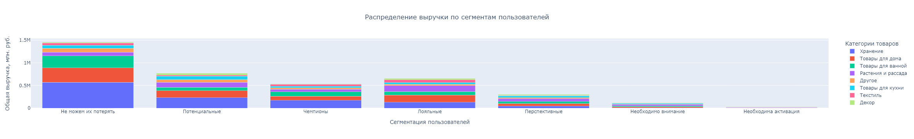
    


1. Как уже ранее отмечали, больше всего выручки приносит сегмент "Не можем их потерять" - суммарно около 1,4 млн. Чаще всего пользователи этого сегмента покупать товары категории Хранение (567 тыс.), Товары для дома (321 тыс.) и Товары для ванной (265 тыс.). Меньше всего покупают Декор - не более 18 тыс. рублей. 
2. Чуть менее выраженный характер потребления у сегмента Чемпионы. Здесь по-прежнему лидирует категория Хранение (171 тыс.), однако остальные категории менее выраженные - практически равные доли у Товаров для Дома и Ванной - 90 и 99 тыс. рублей соответственно. Аналогично у категорий Растения и Рассада, Текстиль и Другое - порядка 50 тыс. рублей на каждую категорию.
3. Более однородный запрос у сегмента Перспективные. Здесь категории распределились практически равномерно. В порядке убывания - Растения и Рассада, Товары для дома, Товары для ванной, Хранение (все по 60-50 тыс.) и др. 


```python
# посмотрим сезонность продаж разных категорий товаров
season = (df.pivot_table(index = ['month', 'category'],
                        values = 'total_cost',
                        aggfunc = 'sum')
          .reset_index()
        )

# построим визуализацию
fig = px.line(
    season,
    y='total_cost',
    x='month',
    color = 'category',
    labels={'total_cost': 'Общая выручка, руб.', 'month': 'Месяц', 'category': 'Категория'},
    title='Сезонность продаж категорий товаров',
)

fig.update_layout(title_x=0.5, showlegend=True)

#Вставляем статическую картинку для корректной загрузки проекта на гитхаб 
Image("C:/anaconda/Jupiter Notebook/Graphs/fig14.png", width=2000, height=1500)
```


    
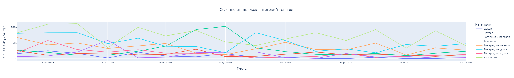
    


1. Категория Хранение лидирует практически во все месяцы за исключением Января 2019, и весны 2019 года (апрель - июнь). Каждый месяц продажи категории хранения приносят от 40 до 110 тыс. рублей. 
2. Заметен сильный всплеск продаж категории Растения и рассада, начиная с марта 2019 и до июня 2019 года. Это можно легко объяснить сезоном высадки рассады. Пик продаж приходится на май - выручка более 100 тыс. рублей. 
3. В июне 2019 года заметен сильный всплеск продаж товаров категории Товары для дома, выводя категорию на первое место по продажам в тот месяц - суммарная выручка 82 тыс. рублей. Назвать это сезонностью сложно. Возможно проводилась маркетинговая акция. 
4. Остальные сегменты хоть и распределены неравномерно в течение года, однако нет возможности выделить характерный всплеск или сезонность. 

### Общий вывод

1. Мы провели RFM-анализ покупателей интернет-магазина. Благодаря анализу мы смогли сегментировать 7 групп пользователей, к каждой из которых можно применять персонализированный подход в продажах:
    - Сегмент **"Не можем их потерять"** - стратегически важные клиенты. Они регулярно совершают покупки на крупные суммы. 
        *Стратегия:* можем направить им особые предложения, участие в программе лояльности. 
        
    - Сегмент **"Чемпионы"** - регулярные покупатели. 
        *Стратегия:* подготовить программу лояльности, начислить бонусы, предложить подарок за покупку или достижение конкретного уровня чека.
    - Сегмент **"Лояльные"** - взаимодействуют с компанией нерегулярно, но при этом тратят большие суммы.
        *Стратегия:* необходимо изучить потребности клиентов и направить персонализированные предложения. Таким клиентам не рекомендуется предлагать скидки.
    - Сегмент **"Потенциальные"** - такие покупатели помнят о компании, когда-то совершали покупки, но сейчас перестали это делать. *Стратегия:* необходимо напомнить о компании посредством рассылки, разработки стимулирующих акций, начисления бонусов на карту лояльности.
    - Сегмент **"Перспективные"** - при правильном взаимодействии могут стать постоянными клиентами.
      *Стратегия:* Этому сегменту нужно оказывать активную помощь в выборе товара, давать полезную информацию.
    - Сегмент **"Необходимо внимание"** - необходимо получить обратную связь, чтобы понять причину отказа от приобретения товаров. Можно начислить бонусы и предложить выгодную акцию. Таких покупателей можно вернуть и сделать постоянными клиентами.
    - Сегмент **"Необходима активация"** - клиенты давно не взаимодействуют с компанией. *Стратегия:* Можно восстановить контакт с помощью рассылки. Настаивать и тратить много времени/сил не рекомендуется.
    
2. Разбивка по сегментам демонстрирует, что практически половину всей выручки компании обеспечивает сегмент "Не можем их потерять" - 1,4 млн рублей. Меньше всего прибыли приносит сегмент "Необходима активация" - 32 тыс. рублей.
3. Средняя выручка с клиента также пропорциональна выделенным сегментам. Больше всего тратят пользователи сегмента "Не можем их потерять" - в среднем 3,3 тыс. рублей. меньше всего "Необходима активация" - не более 200 рублей. Последние скорее всего пришли за одной мелкой покупкой и больше не возвращались. 
4. Дополнительно выделили товарные категории ассортимента интернет-магазина - всего 8 категорий.  Больше всего выручки приносит категория Хранение - более 1,1 млн. рублей. И именно в этой категории больше всего прибыль от товаров группы А. Меньше всего прибыли поступает от категории Декор - не более 140 тыс. рублей. Возможно стоит увеличить товарный ассортимент этой категории. 
5. Проанализировали поведение пользователей каждого сегмента - какие товары пользователи покупают больше всего. 
    - Сегмент "Не можем их потерять" предпочитают покупать товары категории Хранение, Товары для дома и Товары для ванной. Меньше всего покупают Декор - не более 18 тыс. рублей.
    - Сегмент "Чемпионы" также предпочитает товары категории Хранение, однако остальные категории распределены более равномерно - практически равные доли у Товаров для Дома и Ванной (90 и 99 тыс.). Растения и Рассада, Текстиль и Другое - порядка 50 тыс. рублей на каждую категорию.
    - Более однородный запрос у сегмента "Перспективные". Здесь категории распределились практически равномерно. В порядке убывания - Растения и Рассада, Товары для дома, Товары для ванной, Хранение (все по 60-50 тыс.) и др.
    
6. Проанализировали динамику продаж товаров разных категорий. Выявили яркую сезонность у категории Растения и рассада - пик продаж приходится на март - июнь. Остальные сегменты хоть и распределены неравномерно в течение года, однако нет возможности выделить характерный всплеск или сезонность. 

## Проверка статистических гипотез

Для того чтобы вынести окончательные рекомендации для интернет-магазине, необходимо убедиться, что те различия, которые мы идентифицировали между сегментами пользователей действительно статистически значимы. Для этого мы проведем несколько стат. тестов и сравним сегменты между собой. 

Так как перед нами сразу несколько групп для сравнения (сегменты пользователей), мы можем провести тест ANOVA, который используется для сравнения средних значений двух или более выборок.

**Какие гипотезы мы будем проверять?**
1. Средняя выручка между сегментами пользователей отличается и это отличие является статистически значимым.
2. Средний чек между сегментами пользователей отличается и это отличие является статистически значимым.

**Этапы проверки гипотез:**
1. Группировка данных для проведения анализа
2. Проведения теста на нормальность, чтобы проверить, являются ли данные нормально распределенными в каждой из групп. 
3. Формулировка нулевой и альтернативной гипотез
4. Проведение теста и интерпретация результатов. 

### Группировка данных для проведения анализа

Сгруппируем изначальный датафрейм такис образом, чтобы для каждого уникального пользователя отображался средний чек, общая стоимость покупок, а также выделенный сегмент (на базе RFM-анализа). 


```python
# создаем датафрейм для сегмента Не можем их потерять
df_1 = (df.query('segment == "Не можем их потерять"')
        .groupby('customer_id')
        .agg({'order_id': 'nunique',
              'total_cost': 'sum'})
        .round()
        .reset_index()
        .sort_values(by = 'total_cost')
       )
df_1['mean_order'] = df_1['total_cost'] / df_1['order_id']

# создаем датафрейм для сегмента Чемпионы
df_2 = (df.query('segment == "Чемпионы"')
        .groupby('customer_id')
        .agg({'order_id': 'nunique',
              'total_cost': 'sum'})
        .round()
        .reset_index()
        .sort_values(by = 'total_cost')
       )
df_2['mean_order'] = df_2['total_cost'] / df_2['order_id']

# создаем датафрейм для сегмента Лояльные
df_3 = (df.query('segment == "Лояльные"')
        .groupby('customer_id')
        .agg({'order_id': 'nunique',
              'total_cost': 'sum'})
        .round()
        .reset_index()
        .sort_values(by = 'total_cost')
       )
df_3['mean_order'] = df_3['total_cost'] / df_3['order_id']

# создаем датафрейм для сегмента Потенциальные
df_4 = (df.query('segment == "Потенциальные"')
        .groupby('customer_id')
        .agg({'order_id': 'nunique',
              'total_cost': 'sum'})
        .round()
        .reset_index()
        .sort_values(by = 'total_cost')
       )
df_4['mean_order'] = df_4['total_cost'] / df_4['order_id']

# создаем датафрейм для сегмента Перспективные
df_5 = (df.query('segment == "Перспективные"')
        .groupby('customer_id')
        .agg({'order_id': 'nunique',
              'total_cost': 'sum'})
        .round()
        .reset_index()
        .sort_values(by = 'total_cost')
       )
df_5['mean_order'] = df_5['total_cost'] / df_5['order_id']

# создаем датафрейм для сегмента Необходимо внимание
df_6 = (df.query('segment == "Необходимо внимание"')
        .groupby('customer_id')
        .agg({'order_id': 'nunique',
              'total_cost': 'sum'})
        .round()
        .reset_index()
        .sort_values(by = 'total_cost')
       )
df_6['mean_order'] = df_6['total_cost'] / df_6['order_id']

# создаем датафрейм для сегмента Необходима активация
df_7 = (df.query('segment == "Необходима активация"')
        .groupby('customer_id')
        .agg({'order_id': 'nunique',
              'total_cost': 'sum'})
        .round()
        .reset_index()
        .sort_values(by = 'total_cost')
       )
df_7['mean_order'] = df_7['total_cost'] / df_7['order_id']
```


```python
# определяем нормальность распределения для колонки среднего чека 
all_segments_names = {
    1: df_1,
    2: df_2,
    3: df_3,
    4: df_4,
    5: df_5,
    6: df_6,
    7: df_7,
}

alpha = 0.05

for i, df_i in all_segments_names.items():
    stat, p = stats.shapiro(df_i['mean_order'])
    
    if p < alpha:
        print('Statistics=%.3f, p-value=%.3f' % (stat, p))
        print('Отклонить гипотезу о нормальности распределения')
        print(" ")
    else:
        print('Statistics=%.3f, p-value=%.3f' % (stat, p))
        print('Принять гипотезу о нормальности распределения')
        print(" ")
```

    Statistics=0.738, p-value=0.000
    Отклонить гипотезу о нормальности распределения
     
    Statistics=0.645, p-value=0.000
    Отклонить гипотезу о нормальности распределения
     
    Statistics=0.355, p-value=0.000
    Отклонить гипотезу о нормальности распределения
     
    Statistics=0.432, p-value=0.000
    Отклонить гипотезу о нормальности распределения
     
    Statistics=0.929, p-value=0.000
    Отклонить гипотезу о нормальности распределения
     
    Statistics=0.945, p-value=0.000
    Отклонить гипотезу о нормальности распределения
     
    Statistics=0.944, p-value=0.000
    Отклонить гипотезу о нормальности распределения
     
    


```python
# определяем нормальность распределения для колонки общей выручки с покупателя
for i, df_i in all_segments_names.items():
    stat, p = stats.shapiro(df_i['total_cost'])
    
    if p < alpha:
        print('Statistics=%.3f, p-value=%.3f' % (stat, p))
        print('Отклонить гипотезу о нормальности распределения')
        print(" ")
    else:
        print('Statistics=%.3f, p-value=%.3f' % (stat, p))
        print('Принять гипотезу о нормальности распределения')
        print(" ")
```

    Statistics=0.173, p-value=0.000
    Отклонить гипотезу о нормальности распределения
     
    Statistics=0.621, p-value=0.000
    Отклонить гипотезу о нормальности распределения
     
    Statistics=0.287, p-value=0.000
    Отклонить гипотезу о нормальности распределения
     
    Statistics=0.424, p-value=0.000
    Отклонить гипотезу о нормальности распределения
     
    Statistics=0.934, p-value=0.000
    Отклонить гипотезу о нормальности распределения
     
    Statistics=0.948, p-value=0.000
    Отклонить гипотезу о нормальности распределения
     
    Statistics=0.944, p-value=0.000
    Отклонить гипотезу о нормальности распределения
     
    

Во всех проверках на нормальность распределения мы получили отрицательный результат. В таком случае мы не можем использовать параметрический тест ANOVA. Непараметрическая альтернатива такому тесту - критерий Краскела-Уоллиса. 

### Формулировка нулевой и альтернативной гипотез

**Проверка № 1** - Средняя выручка между сегментами пользователей отличается и это отличие является статистически значимым.

Тест Краскела-Уоллиса является ранговым и проводит сравнение не по среднему показателю, а по медианному. В таком случае гипотезы будут звучать следующим образом:

*Нулевая гипотеза (H0):* Медианная выручка одинакова для всех сегментов.

*Альтернативная гипотеза: (Ha):* Медианная выручка не одинакова для всех сегментов и это отличие является статистически значимым. 

**Проверка № 2** - Средний чек между сегментами пользователей отличается и это отличие является статистически значимым.

*Нулевая гипотеза (H0):* Медианная чек одинаков для всех сегментов пользователей.

*Альтернативная гипотеза: (Ha):* Медианная чек не одинаков для всех сегментов и это отличие является статистически значимым. 

### Проведение теста и интерпретация результатов.


```python
# проверка гипотезы о равенстве медианной выручки
stat, p = stats.kruskal(df_1['total_cost'],
                        df_2['total_cost'],
                        df_3['total_cost'],
                        df_4['total_cost'],
                        df_5['total_cost'],
                        df_6['total_cost'],
                        df_7['total_cost'])
if p < alpha:
        print('Statistics=%.2f, p-value=%.3f' % (stat, p))
        print('Отвергаем нулевую гипотезу: между сегментами есть значимая разница')
        print(" ")
else:
        print('Statistics=%.2f, p-value=%.3f' % (stat, p))
        print('Не получилось отвергнуть нулевую гипотезу, нет оснований считать медианную выручку между сегментами разной')
        print(" ")
```

    Statistics=1069.02, p-value=0.000
    Отвергаем нулевую гипотезу: между сегментами есть значимая разница
     
    


```python
# для проверки гипотезы о равенстве медианного чека
# необходимо дополнительно ранжировать датасеты по возрастанию среднего чека
df_1 = df_1.sort_values(by = 'mean_order')
df_2 = df_2.sort_values(by = 'mean_order')
df_3 = df_3.sort_values(by = 'mean_order')
df_4 = df_4.sort_values(by = 'mean_order')
df_5 = df_5.sort_values(by = 'mean_order')
df_6 = df_6.sort_values(by = 'mean_order')
df_7 = df_7.sort_values(by = 'mean_order')

# проверка гипотезы о равенстве медианного чека
stat, p = stats.kruskal(df_1['mean_order'],
                        df_2['mean_order'],
                        df_3['mean_order'],
                        df_4['mean_order'],
                        df_5['mean_order'],
                        df_6['mean_order'],
                        df_7['mean_order'])
if p < alpha:
        print('Statistics=%.2f, p-value=%.3f' % (stat, p))
        print('Отвергаем нулевую гипотезу: между сегментами есть значимая разница')
        print(" ")
else:
        print('Statistics=%.2f, p-value=%.3f' % (stat, p))
        print('Не получилось отвергнуть нулевую гипотезу, нет оснований считать медианную выручку между сегментами разной')
        print(" ")
```

    Statistics=600.86, p-value=0.000
    Отвергаем нулевую гипотезу: между сегментами есть значимая разница
     
    

В обоих случаях нулевая гипотеза была опровергнута в пользу альтернативной. Таким образом, мы с достаточной долей уверенности можем утверждать, что между выделенными нами сегментами пользователей есть статистически значимая разница как в медианной выручке с пользователя, так и в медианном чеке с покупки.

Благодаря проверке мы можем утверждать, что сегменты имеют место быть. Осталось проверить, все ли сегменты имеют статистически значимую разницу между собой. Проведем попарные сравнения каждого сегмента. Гипотезы остаются те же. 

Важно учесть, что мы проводим сразу несколько попарных тестов, поэтому важно применить поправку Бонферрони. Корректной стат. значимостью можно считать следующую:
alpha / "кол-во экспериментов" = 0,05 / 42 = 0.00119048


```python
# проверка гипотезы о равенстве средней выручки между парами сегментов
alpha = 0.00119048

for i, df_i in all_segments_names.items():
    name_i = 'Сегмент № ' + str(i)
    for j, df_j in all_segments_names.items():
        
        if i >= j:
            continue
            
        name_j = 'Сегмент № ' + str(j)
        stat, p = stats.ttest_ind(a=df_i['total_cost'], b=df_j['total_cost'], equal_var=False)
        print("Проверка гипотезы для пары:",  f"{name_i} and {name_j}")
        print('Statistics=%.2f, p-value=%.3f' % (stat, p))
        if p < alpha:
            print('Отвергаем нулевую гипотезу: между сегментами есть значимая разница')
        else:
            print('Не получилось отвергнуть нулевую гипотезу, нет оснований считать среднюю выручку между сегментами разной')

        print(" ")
```

    Проверка гипотезы для пары: Сегмент № 1 and Сегмент № 2
    Statistics=3.48, p-value=0.001
    Отвергаем нулевую гипотезу: между сегментами есть значимая разница
     
    Проверка гипотезы для пары: Сегмент № 1 and Сегмент № 3
    Statistics=3.39, p-value=0.001
    Отвергаем нулевую гипотезу: между сегментами есть значимая разница
     
    Проверка гипотезы для пары: Сегмент № 1 and Сегмент № 4
    Statistics=3.51, p-value=0.000
    Отвергаем нулевую гипотезу: между сегментами есть значимая разница
     
    Проверка гипотезы для пары: Сегмент № 1 and Сегмент № 5
    Statistics=6.64, p-value=0.000
    Отвергаем нулевую гипотезу: между сегментами есть значимая разница
     
    Проверка гипотезы для пары: Сегмент № 1 and Сегмент № 6
    Statistics=7.30, p-value=0.000
    Отвергаем нулевую гипотезу: между сегментами есть значимая разница
     
    Проверка гипотезы для пары: Сегмент № 1 and Сегмент № 7
    Statistics=7.73, p-value=0.000
    Отвергаем нулевую гипотезу: между сегментами есть значимая разница
     
    Проверка гипотезы для пары: Сегмент № 2 and Сегмент № 3
    Statistics=0.26, p-value=0.797
    Не получилось отвергнуть нулевую гипотезу, нет оснований считать среднюю выручку между сегментами разной
     
    Проверка гипотезы для пары: Сегмент № 2 and Сегмент № 4
    Statistics=0.14, p-value=0.891
    Не получилось отвергнуть нулевую гипотезу, нет оснований считать среднюю выручку между сегментами разной
     
    Проверка гипотезы для пары: Сегмент № 2 and Сегмент № 5
    Statistics=8.96, p-value=0.000
    Отвергаем нулевую гипотезу: между сегментами есть значимая разница
     
    Проверка гипотезы для пары: Сегмент № 2 and Сегмент № 6
    Statistics=11.02, p-value=0.000
    Отвергаем нулевую гипотезу: между сегментами есть значимая разница
     
    Проверка гипотезы для пары: Сегмент № 2 and Сегмент № 7
    Statistics=12.34, p-value=0.000
    Отвергаем нулевую гипотезу: между сегментами есть значимая разница
     
    Проверка гипотезы для пары: Сегмент № 3 and Сегмент № 4
    Statistics=-0.14, p-value=0.885
    Не получилось отвергнуть нулевую гипотезу, нет оснований считать среднюю выручку между сегментами разной
     
    Проверка гипотезы для пары: Сегмент № 3 and Сегмент № 5
    Statistics=5.34, p-value=0.000
    Отвергаем нулевую гипотезу: между сегментами есть значимая разница
     
    Проверка гипотезы для пары: Сегмент № 3 and Сегмент № 6
    Statistics=6.59, p-value=0.000
    Отвергаем нулевую гипотезу: между сегментами есть значимая разница
     
    Проверка гипотезы для пары: Сегмент № 3 and Сегмент № 7
    Statistics=7.41, p-value=0.000
    Отвергаем нулевую гипотезу: между сегментами есть значимая разница
     
    Проверка гипотезы для пары: Сегмент № 4 and Сегмент № 5
    Statistics=7.90, p-value=0.000
    Отвергаем нулевую гипотезу: между сегментами есть значимая разница
     
    Проверка гипотезы для пары: Сегмент № 4 and Сегмент № 6
    Statistics=9.73, p-value=0.000
    Отвергаем нулевую гипотезу: между сегментами есть значимая разница
     
    Проверка гипотезы для пары: Сегмент № 4 and Сегмент № 7
    Statistics=10.91, p-value=0.000
    Отвергаем нулевую гипотезу: между сегментами есть значимая разница
     
    Проверка гипотезы для пары: Сегмент № 5 and Сегмент № 6
    Statistics=10.41, p-value=0.000
    Отвергаем нулевую гипотезу: между сегментами есть значимая разница
     
    Проверка гипотезы для пары: Сегмент № 5 and Сегмент № 7
    Statistics=18.62, p-value=0.000
    Отвергаем нулевую гипотезу: между сегментами есть значимая разница
     
    Проверка гипотезы для пары: Сегмент № 6 and Сегмент № 7
    Statistics=10.92, p-value=0.000
    Отвергаем нулевую гипотезу: между сегментами есть значимая разница
     
    

При попарном сравнении становится ясно, что не все сегменты имеют стат. значимые отличия между собой. Не удалось опровергнуть нулевую гипотезу в случае с сегментами 2, 3, 4 - Чемпионы, Лояльные и Потенциальные. Во всех остальных случаях между сегментами присутствует стат. значимая разница средней выручки. 

Это значит, что мы всё ещё можем использовать нашу сегментацию в рамках подготовки рекомендаций для бизнеса, но с пометкой, что сегменты Чемпионы, Лояльные и Потенциальные возможно переформатировать на более укрупненные. 


```python
# проверка гипотезы о равенстве среднего чека между парами сегментов

for i, df_i in all_segments_names.items():
    name_i = 'Сегмент № ' + str(i)
    for j, df_j in all_segments_names.items():
        
        if i >= j:
            continue
            
        name_j = 'Сегмент № ' + str(j)
        stat, p = stats.ttest_ind(a=df_i['mean_order'], b=df_j['mean_order'], equal_var=False)
        print("Проверка гипотезы для пары:",  f"{name_i} and {name_j}")
        print('Statistics=%.2f, p-value=%.3f' % (stat, p))
        if p < alpha:
            print('Отвергаем нулевую гипотезу: между сегментами есть значимая разница')
        else:
            print('Не получилось отвергнуть нулевую гипотезу, нет оснований считать средний чек между сегментами разным')

        print(" ")
```

    Проверка гипотезы для пары: Сегмент № 1 and Сегмент № 2
    Statistics=-0.17, p-value=0.865
    Не получилось отвергнуть нулевую гипотезу, нет оснований считать средний чек между сегментами разным
     
    Проверка гипотезы для пары: Сегмент № 1 and Сегмент № 3
    Statistics=-1.12, p-value=0.262
    Не получилось отвергнуть нулевую гипотезу, нет оснований считать средний чек между сегментами разным
     
    Проверка гипотезы для пары: Сегмент № 1 and Сегмент № 4
    Statistics=-2.73, p-value=0.007
    Не получилось отвергнуть нулевую гипотезу, нет оснований считать средний чек между сегментами разным
     
    Проверка гипотезы для пары: Сегмент № 1 and Сегмент № 5
    Statistics=12.99, p-value=0.000
    Отвергаем нулевую гипотезу: между сегментами есть значимая разница
     
    Проверка гипотезы для пары: Сегмент № 1 and Сегмент № 6
    Statistics=18.46, p-value=0.000
    Отвергаем нулевую гипотезу: между сегментами есть значимая разница
     
    Проверка гипотезы для пары: Сегмент № 1 and Сегмент № 7
    Statistics=22.00, p-value=0.000
    Отвергаем нулевую гипотезу: между сегментами есть значимая разница
     
    Проверка гипотезы для пары: Сегмент № 2 and Сегмент № 3
    Statistics=-0.87, p-value=0.382
    Не получилось отвергнуть нулевую гипотезу, нет оснований считать средний чек между сегментами разным
     
    Проверка гипотезы для пары: Сегмент № 2 and Сегмент № 4
    Statistics=-2.17, p-value=0.030
    Не получилось отвергнуть нулевую гипотезу, нет оснований считать средний чек между сегментами разным
     
    Проверка гипотезы для пары: Сегмент № 2 and Сегмент № 5
    Statistics=6.45, p-value=0.000
    Отвергаем нулевую гипотезу: между сегментами есть значимая разница
     
    Проверка гипотезы для пары: Сегмент № 2 and Сегмент № 6
    Statistics=8.75, p-value=0.000
    Отвергаем нулевую гипотезу: между сегментами есть значимая разница
     
    Проверка гипотезы для пары: Сегмент № 2 and Сегмент № 7
    Statistics=10.25, p-value=0.000
    Отвергаем нулевую гипотезу: между сегментами есть значимая разница
     
    Проверка гипотезы для пары: Сегмент № 3 and Сегмент № 4
    Statistics=-0.99, p-value=0.320
    Не получилось отвергнуть нулевую гипотезу, нет оснований считать средний чек между сегментами разным
     
    Проверка гипотезы для пары: Сегмент № 3 and Сегмент № 5
    Statistics=5.38, p-value=0.000
    Отвергаем нулевую гипотезу: между сегментами есть значимая разница
     
    Проверка гипотезы для пары: Сегмент № 3 and Сегмент № 6
    Statistics=6.90, p-value=0.000
    Отвергаем нулевую гипотезу: между сегментами есть значимая разница
     
    Проверка гипотезы для пары: Сегмент № 3 and Сегмент № 7
    Statistics=7.89, p-value=0.000
    Отвергаем нулевую гипотезу: между сегментами есть значимая разница
     
    Проверка гипотезы для пары: Сегмент № 4 and Сегмент № 5
    Statistics=7.75, p-value=0.000
    Отвергаем нулевую гипотезу: между сегментами есть значимая разница
     
    Проверка гипотезы для пары: Сегмент № 4 and Сегмент № 6
    Statistics=9.53, p-value=0.000
    Отвергаем нулевую гипотезу: между сегментами есть значимая разница
     
    Проверка гипотезы для пары: Сегмент № 4 and Сегмент № 7
    Statistics=10.69, p-value=0.000
    Отвергаем нулевую гипотезу: между сегментами есть значимая разница
     
    Проверка гипотезы для пары: Сегмент № 5 and Сегмент № 6
    Statistics=10.06, p-value=0.000
    Отвергаем нулевую гипотезу: между сегментами есть значимая разница
     
    Проверка гипотезы для пары: Сегмент № 5 and Сегмент № 7
    Statistics=18.11, p-value=0.000
    Отвергаем нулевую гипотезу: между сегментами есть значимая разница
     
    Проверка гипотезы для пары: Сегмент № 6 and Сегмент № 7
    Statistics=10.71, p-value=0.000
    Отвергаем нулевую гипотезу: между сегментами есть значимая разница
     
    

Не удалось найти стат. значимые отличия в среднем чеке пользователей сегментов 1, 2, 3 и 4 - Не можем их потерять, Чемпионы, Лояльные и Потенциальные. В остальных случаях средний чек отличается между сегментами и это отличие можно считать стат.значимым. 

Это значит, что скорее всего топ-4 сегмента тратят за покупку в среднем одинаково, но в сегментации отличаются по другим параметрам - Кол-ве покупок и в сроке между покупками. 

## Результат исследования

**Общий вывод исследования**
1. В нашем распоряжении оказался файл `ecom_dataset_upd` с описанием транзакций интернет-магазина товаров для дома и быта «Пока все ещё тут». Данные для анализа представлены с 1 октября 2018 года по 31 января 2020 года.
2. Перед проведением анализа мы провели предобработку данных: 
    - Названия колонок приведены к нижнему регистру;
    - Датасеты проверены на отсутствие явных и неявных дубликатов, пропусков в данных;
    - Тип данных некоторых колонок приведен к нужному формату;
    - Добавили несколько колонок для удобства дальнейшего анализа;
3. В рамках исследовательского анализа были выявлены следующие особенности:
    - В нашем распоряжении оказались данные о 3432 заказах и 2362 уникальных пользователей. Период исследования - 1 октября 2018 - 31 января 2020 года. 
    - Мы определили 2 разных периода оптимальных для анализа:
      - полный 2019 год для анализа финансовых показателей;
      - весь датасет для анализа поведения пользователей;
    - При общей выручке в 2,5 млн. рублей за 2019 год, месячная выручка лишь 2 месяца достигала показатель 300 тыс. - в феврале и апреле. Самые активные продажи произошли в начале года. **Общая тенденция - уменьшение объемов продаж.**
    - Средний чек покупателя в 2019 году составил 1020.5 руб. **Общий тренд - снижение среднего чека в течение года.**
    - Мы провели ABC-анализ, который показал, что 27% товарного ассортимента магазина приносят компании 80% всей выручки (Категория А). Такие товары выгоднее всего продавать и на их реализации можно будет в будущем сконцентрироваться. Категория С (43% товаров) принесла компании всего 5% всей выручки. Мы сохранили категории товаров в отдельные списки, которые в дальнейшем можно будет передать маркетинговому отделу.
    - Стандартный покупатель интернет-магазина в среднем делает 1-2 покупки.
    - В среднем между повторными покупками покупателей проходит 221 день. Медианное число - 262 дня. Это значит, что наш "типичный" покупатель, если и возвращается за повторной покупкой, то минимум через полгода, а то и дольше. 

4. Для формирования рекомендаций для компании иы провели RFM-анализ покупателей интернет-магазина. Благодаря анализу мы смогли сегментировать 7 групп пользователей, к каждой из которых можно применять персонализированный подход в продажах. 
5. Разбивка по сегментам демонстрирует, что практически половину всей выручки компании обеспечивает сегмент "Не можем их потерять" - 1,6 млн рублей. Меньше всего прибыли приносит сегмент "Необходима активация" - 26 тыс. рублей.
6. Дополнительно выделили товарные категории ассортимента интернет-магазина - всего 8 категорий.  Больше всего выручки приносит категория Хранение - более 1,1 млн. рублей. И именно в этой категории больше всего прибыль от товаров группы А. Меньше всего прибыли поступает от категории Декор - не более 100 тыс. рублей. Возможно стоит увеличить товарный ассортимент этой категории. 
7. Проанализировали поведение пользователей каждого сегмента - какие товары пользователи покупают больше всего. 
    - Сегмент "Не можем их потерять" предпочитают покупать товары категории Хранение, Товары для дома и Товары для ванной. Меньше всего покупают Декор - не более 22 тыс. рублей.
    - Сегмент "Чемпионы" также предпочитает товары категории Хранение, однако остальные категории распределены более равномерно - практически равные доли у Товаров для Дома и Ванной (103 и 100 тыс.). Растения и Рассада, Текстиль и Другое - порядка 50 тыс. рублей на каждую категорию.
    - Более однородный запрос у сегмента "Перспективные". Здесь категории распределились практически равномерно. В порядке убывания - Товары для дома, Хранение, Товары для ванной (все по 40-48 тыс.) и др.
8. Проанализировали динамику продаж товаров разных категорий. Выявили яркую сезонность у категории Растения и рассада - пик продаж приходится на март - июнь. 
9. Проверили гипотезы о стат.значимости различий между сегментами покупателей по медианному чеку и медианной выручке с покупателя. В случае с проверкой средней выручки не удалось опровергнуть нулевую гипотезу в случае с сегментами Чемпионы, Лояльные и Потенциальные. Это значит, что мы всё ещё можем использовать нашу сегментацию в рамках подготовки рекомендаций для бизнеса, но с пометкой, что сегменты Чемпионы, Лояльные и Потенциальные возможно переформатировать на более укрупненные.
   Средний чек не имеет стат.значимое отличие в случае сегментов Не можем их потерять, Чемпионы, Лояльные и Потенциальные. Скорее всего топ-4 сегментов тратят за покупку в среднем одинаково, но в сегментации отличаются по другим параметрам - Кол-ве покупок и в сроке между покупками.


**Общие рекомендации для интернет-магазина**
1. обратить внимание на снижающиеся объемы продаж, а также на снижение среднего чека в течение всего года. 
2. Дополнительно проработать стратегию по удержанию пользователей. Проанализировать возможности проведения акций, которые бы участили визиты пользователей на сайт.
3. Проанализировать списки товаров, которые продаются меньше всего (Категория С). Принять решение о выводе из реализации, либо увеличить промотирование этих товаров.
4. Проработать персонализированный подход к клиентам, основываясь на сегментации и предпочтениях каждого сегмента. 
    - Сегмент **"Не можем их потерять"** - стратегически важные клиенты.
        *Стратегия:* можем направить им особые предложения, участие в программе лояльности. Предлагать категории Хранение, Товары для дома и Товары для ванной. 
        
    - Сегмент **"Чемпионы"** - регулярные покупатели. 
        *Стратегия:* подготовить программу лояльности, начислить бонусы, предложить подарок за покупку или достижение конкретного уровня чека. Предлагать - Товаров для Дома и Ванной.
    - Сегмент **"Лояльные"** - взаимодействуют с компанией нерегулярно, но при этом тратят большие суммы.
        *Стратегия:* необходимо изучить потребности клиентов и направить персонализированные предложения. Таким клиентам не рекомендуется предлагать скидки. Категории - 
    - Сегмент **"Потенциальные"** - такие покупатели помнят о компании, когда-то совершали покупки, но сейчас перестали это делать. *Стратегия:* необходимо напомнить о компании посредством рассылки, разработки стимулирующих акций, начисления бонусов на карту лояльности. Категории - Товары для ванной, Растения и Рассада. 
    - Сегмент **"Перспективные"** - при правильном взаимодействии могут стать постоянными клиентами.
      *Стратегия:* Этому сегменту нужно оказывать активную помощь в выборе товара, давать полезную информацию. Категории - Товары для дома, ванной и кухни. 
    - Сегмент **"Необходимо внимание"** - необходимо получить обратную связь, чтобы понять причину отказа от приобретения товаров. Можно начислить бонусы и предложить выгодную акцию. Таких покупателей можно вернуть и сделать постоянными клиентами.
    - Сегмент **"Необходима активация"** - клиенты давно не взаимодействуют с компанией. *Стратегия:* Можно восстановить контакт с помощью рассылки. Настаивать и тратить много времени/сил не рекомендуется.
    
